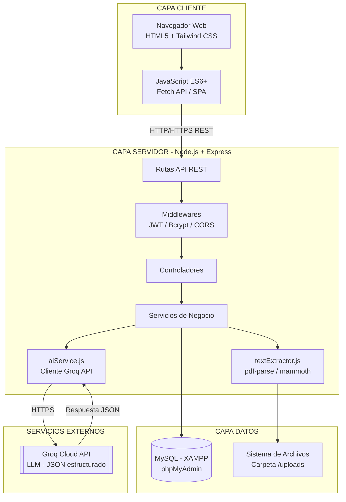

# 01 - Arquitectura y Tecnologías

**Proyecto:** Gestión de Facturas y Cotizaciones con IA
**Fase:** II - Diseño del Sistema
**Asignatura:** Desarrollo de Aplicaciones Empresariales - 6° Semestre UTS

---

## 1. Introducción

Este documento describe la arquitectura general de la solución **gestion-facturas-cotizaciones-ia**, un sistema web orientado a la gestión documental de facturas y cotizaciones, potenciado con un módulo de Inteligencia Artificial para extracción estructurada de datos y consulta semántica en lenguaje natural. Se detallan el patrón arquitectónico adoptado, las capas del sistema, el flujo de integración con la API de Groq, y la justificación técnica formal de cada decisión tecnológica.

---

## 2. Arquitectura General de la Solución

### 2.1 Patrón Arquitectónico

El sistema adopta una **arquitectura Cliente-Servidor de tres capas**, implementada internamente en el backend bajo el patrón **MVC (Modelo-Vista-Controlador)** adaptado a una API RESTful (sin vistas renderizadas en servidor, ya que el frontend es una SPA ligera basada en HTML5 + JS).

- **Cliente (Frontend):** Aplicación web ligera (HTML5, Tailwind CSS, JavaScript ES6+) que consume servicios REST mediante `fetch`.
- **Servidor (Backend):** API RESTful construida con Node.js y Express, responsable de la lógica de negocio, autenticación, procesamiento documental y orquestación de la IA.
- **Persistencia (Datos):** Motor MySQL administrado con XAMPP/phpMyAdmin, más un sistema de archivos local para el almacenamiento físico de documentos.

### 2.2 Diagrama de Arquitectura General

### 2.3 Flujo de Integración con la API de Groq

El módulo de Inteligencia Artificial actúa como un servicio interno (`aiService.js`) desacoplado de los controladores, siguiendo el principio de responsabilidad única:

1. El controlador de documentos recibe la solicitud de análisis.
2. Se invoca `textExtractor.js` para obtener el texto plano del archivo (PDF, DOCX o TXT).
3. `aiService.js` construye un *prompt* de sistema que exige una respuesta en formato **JSON estricto**, y realiza la petición HTTPS a la API de Groq.
4. La respuesta JSON es validada (esquema y tipos de datos) antes de persistirse en la tabla `analisis_ia`.
5. Si ocurre un error de red, de formato o de la API externa, se registra en la tabla `logs_errores` y se retorna un mensaje controlado al cliente.

Este desacoplamiento permite que, en el futuro, el proveedor de IA (Groq) pueda sustituirse por otro (OpenAI, Anthropic, modelos locales) sin afectar la lógica de negocio ni los controladores.

---

## 3. Arquitectura por Capas

### 3.1 Capa Frontend

- **HTML5 semántico:** estructura de páginas independientes (login, dashboard, repositorios, chat IA).
- **Tailwind CSS:** framework de utilidades CSS que permite un diseño responsive y consistente sin necesidad de hojas de estilo extensas ni preprocesadores adicionales.
- **JavaScript ES6+ (Vanilla):** manejo de estado en memoria, consumo de la API mediante `fetch`, manipulación del DOM y gestión de tokens JWT en `localStorage`/`sessionStorage`.
- **Justificación:** se evita la sobrecarga de un framework SPA completo (React/Vue) dado el alcance académico y los tiempos de entrega, priorizando dominio de fundamentos y bajo acoplamiento.

### 3.2 Capa Backend

- **Node.js:** entorno de ejecución basado en el motor V8, con modelo de I/O no bloqueante, ideal para operaciones intensivas en E/S como la lectura de archivos y las llamadas HTTP a la API de Groq.
- **Express.js:** framework minimalista para la definición de rutas, middlewares y controladores, con amplio soporte de la comunidad y curva de aprendizaje adecuada al nivel del curso.
- **Middlewares clave:**
  - `authMiddleware`: validación de JWT en cada petición protegida.
  - `roleMiddleware`: control de acceso basado en roles (RBAC).
  - `multer`: manejo de subida de archivos multipart/form-data.
  - `errorHandler`: captura centralizada de excepciones.

### 3.3 Capa de Datos

- **MySQL (XAMPP/phpMyAdmin):** motor de base de datos relacional, adecuado para modelar las relaciones fuertes entre usuarios, repositorios, documentos y resultados de IA, garantizando integridad referencial mediante llaves foráneas.
- **mysql2/promise:** driver de conexión con soporte de *promesas* y *prepared statements*, mitigando inyección SQL.

### 3.4 Almacenamiento Local de Archivos

- Los archivos originales (PDF/DOCX/TXT) se almacenan físicamente en una carpeta `/uploads` del servidor, mientras que la base de datos únicamente conserva la ruta relativa y los metadatos (nombre, tamaño, tipo MIME, fecha).
- Esta separación evita sobrecargar la base de datos con contenido binario (BLOBs), mejorando el rendimiento de las consultas.

### 3.5 Módulo de Inteligencia Artificial

- **Groq API:** seleccionada por ofrecer inferencia de alta velocidad sobre modelos LLM de código abierto (Llama 3.x) de forma gratuita dentro de límites de uso razonables para un entorno académico.
- El módulo `aiService.js` gestiona:
  - Construcción de *prompts* de extracción (documento → JSON estructurado).
  - Construcción de *prompts* conversacionales (chat semántico sobre el contenido ya extraído).
  - Manejo de *timeouts*, reintentos controlados y errores de la API externa.

---

## 4. Decisiones Tecnológicas y Justificación Técnica Formal

| Tecnología | Rol en el sistema | Justificación técnica |
|---|---|---|
| **Node.js** | Entorno de ejecución del backend | Modelo asíncrono no bloqueante idóneo para E/S de archivos y llamadas HTTP externas concurrentes; unifica el lenguaje (JS) entre frontend y backend. |
| **Express.js** | Framework web/API REST | Minimalista, extensible mediante middlewares, estándar de facto en el ecosistema Node para APIs REST; documentación extensa. |
| **MySQL (XAMPP)** | Persistencia relacional | Modelo relacional adecuado para datos altamente estructurados y con relaciones 1:N claras (usuario→repositorio→documento→análisis); XAMPP simplifica el despliegue local para fines académicos. |
| **phpMyAdmin** | Administración de BD | Interfaz gráfica que facilita la verificación del modelo de datos y la depuración durante el desarrollo. |
| **Tailwind CSS** | Estilado del frontend | Reduce CSS personalizado, favorece consistencia visual y desarrollo ágil mediante clases utilitarias. |
| **JavaScript ES6+** | Lógica de cliente | Soporta módulos, `async/await`, `fetch` nativo y clases, sin dependencias de build adicionales. |
| **Groq API** | Motor de IA | Inferencia de baja latencia, capa gratuita suficiente para uso académico, y soporte de modelos con salida en JSON estructurado. |
| **JWT (jsonwebtoken)** | Autenticación | Mecanismo *stateless*, escalable, estándar de la industria para APIs REST. |
| **bcryptjs** | Seguridad de contraseñas | Hashing con *salt* adaptativo, resistente a ataques de fuerza bruta y *rainbow tables*. |
| **multer** | Carga de archivos | Middleware estándar de Express para manejo de `multipart/form-data`. |
| **pdf-parse / mammoth** | Extracción de texto | Librerías especializadas y ligeras para extraer texto plano de PDF y DOCX respectivamente, sin dependencias nativas complejas. |

---

## 5. Conclusión

La arquitectura propuesta separa claramente las responsabilidades de presentación, lógica de negocio, persistencia y procesamiento de IA, favoreciendo la mantenibilidad, la escalabilidad horizontal del backend y la sustitución futura de componentes (por ejemplo, cambiar de proveedor de IA o migrar de MySQL a otro motor) sin reescribir la aplicación completa.
