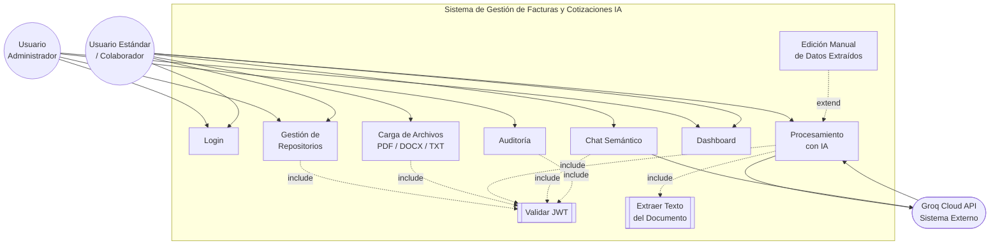
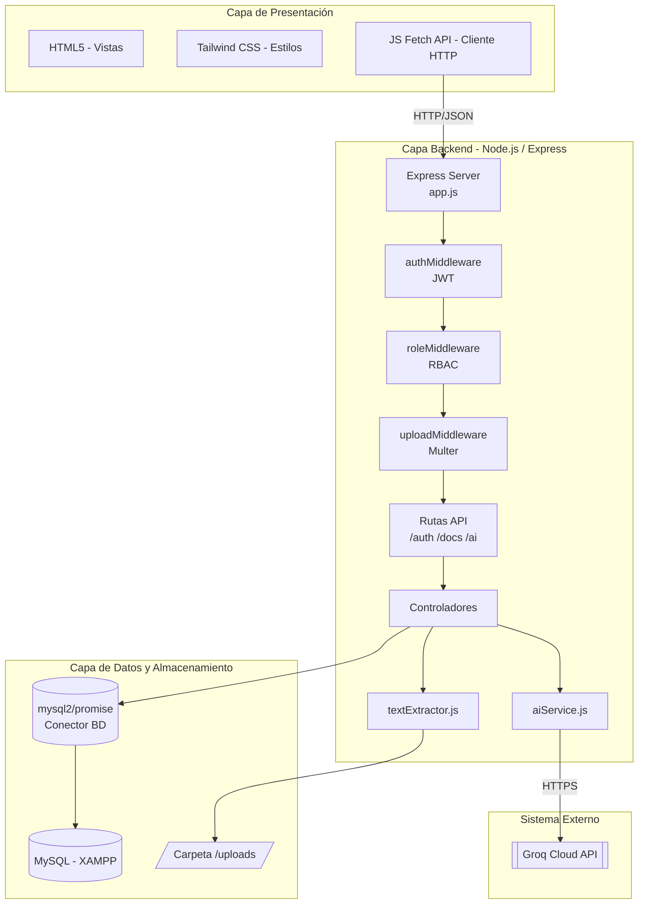
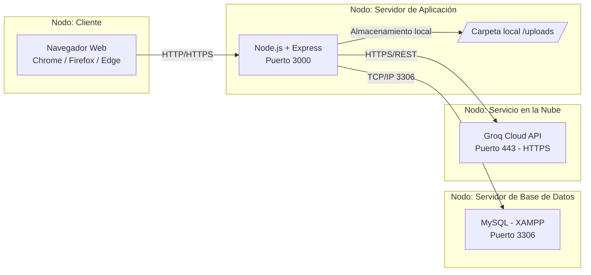
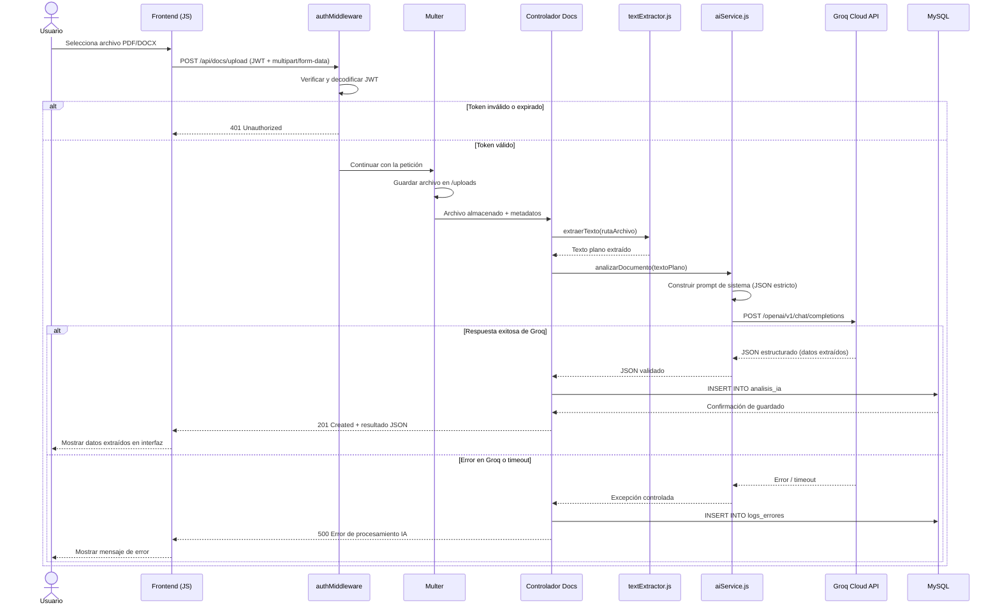

# 02 - Diagramas UML

**Proyecto:** Gestión de Facturas y Cotizaciones con IA
**Fase:** II - Diseño del Sistema

---

## 1. Diagrama de Casos de Uso

### 1.1 Actores

- **Usuario Administrador:** gestiona usuarios, repositorios globales y accede a auditoría completa del sistema.
- **Usuario Estándar / Colaborador:** gestiona sus propios repositorios, carga documentos y consulta el chat semántico.
- **Groq Cloud API (sistema externo):** actor no humano que recibe el texto extraído y retorna el análisis estructurado en JSON.

### 1.2 Casos de Uso Identificados

1. **Login** — autenticación de credenciales y emisión de JWT.
2. **Gestión de Repositorios** — crear, editar, listar y eliminar repositorios documentales.
3. **Carga de Archivos (PDF/DOCX/TXT)** — subir documentos a un repositorio.
4. **Procesamiento con IA** — enviar el texto extraído a Groq y persistir el resultado.
5. **Chat Semántico** — realizar consultas en lenguaje natural sobre el contenido analizado.
6. **Dashboard** — visualizar métricas e indicadores de uso del sistema.
7. **Auditoría** — consultar registros de actividad y errores del sistema.

### 1.3 Código Mermaid.js

### 1.4 Explicación Narrativa

El diagrama refleja que casi todos los casos de uso protegidos (gestión de repositorios, carga de archivos, procesamiento con IA, chat semántico y auditoría) dependen obligatoriamente de la validación de JWT mediante la relación **`<<include>>`**, dado que sin un token válido ninguna operación sensible puede ejecutarse. De igual forma, **Procesamiento con IA** incluye obligatoriamente la extracción previa de texto del documento. La **edición manual de datos extraídos** se modela como una relación **`<<extend>>`** sobre "Procesamiento con IA", ya que es un comportamiento opcional que solo ocurre si el usuario decide corregir el JSON generado por la IA. El actor externo **Groq Cloud API** participa activamente en los casos de uso de procesamiento con IA y chat semántico, recibiendo solicitudes y devolviendo respuestas estructuradas.

---

## 2. Diagrama de Componentes

### 2.1 Explicación Narrativa

El componente **Express Server** centraliza el enrutamiento y aplica de forma secuencial los middlewares de seguridad: primero `authMiddleware` (validación de token), luego `roleMiddleware` (verificación de permisos) y, en las rutas de carga, `uploadMiddleware` (Multer). Los **controladores** orquestan la lógica delegando la extracción de texto a `textExtractor.js` y la comunicación con el modelo de lenguaje a `aiService.js`. La capa de datos se abstrae mediante el conector `mysql2/promise`, que expone una interfaz basada en promesas hacia MySQL, mientras que los archivos físicos se mantienen desacoplados en el sistema de archivos del servidor.

---

## 3. Diagrama de Despliegue

### 3.1 Explicación Narrativa

El despliegue contempla cuatro nodos físicos/lógicos: el **navegador del cliente**, que consume la aplicación vía HTTP/HTTPS; el **servidor de aplicación Node.js** escuchando en el puerto **3000**, responsable de la lógica de negocio y el almacenamiento temporal/local de archivos subidos; el **servidor de base de datos MySQL** gestionado por XAMPP en el puerto **3306**, accesible únicamente desde el servidor de aplicación; y el nodo externo **Groq Cloud API**, consumido exclusivamente vía HTTPS en el puerto **443**. En un entorno académico, los tres primeros nodos suelen coexistir en la misma máquina física (localhost), mientras que Groq permanece siempre externo.

---

## 4. Diagrama de Secuencia — Flujo de Carga y Procesamiento con IA

### 4.1 Explicación Narrativa

El flujo comienza con la selección del archivo por parte del usuario y su envío mediante una petición `multipart/form-data` que incluye el token JWT en el encabezado `Authorization`. El `authMiddleware` valida el token antes de permitir que la petición continúe; si el token es inválido, la cadena se corta inmediatamente con un `401`. Superada la autenticación, **Multer** persiste físicamente el archivo en `/uploads` y pasa el control al controlador, quien delega la extracción de texto a `textExtractor.js`. El texto resultante se envía a `aiService.js`, que construye un *prompt* de sistema exigiendo una respuesta en **JSON estricto** y realiza la llamada HTTPS a Groq. Dependiendo del resultado, el sistema persiste el análisis en `analisis_ia` o registra la falla en `logs_errores`, garantizando trazabilidad completa del proceso en ambos escenarios.
