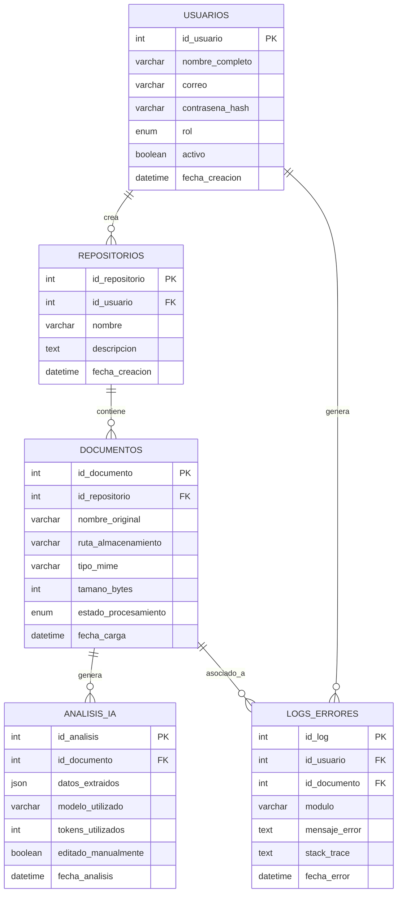

# 03 - Modelo de Datos y Diccionario de Datos

**Proyecto:** Gestión de Facturas y Cotizaciones con IA
**Fase:** II - Diseño del Sistema
**Motor de Base de Datos:** MySQL (administrado con XAMPP / phpMyAdmin)

---

## 1. Modelo Entidad-Relación (MER)

### 1.1 Explicación Narrativa del Modelo

El modelo gira en torno a la entidad **USUARIOS**, quienes son propietarios de uno o más **REPOSITORIOS** (relación 1:N). Cada repositorio agrupa múltiples **DOCUMENTOS** cargados por el usuario. Cada documento puede generar, como máximo, un registro en **ANALISIS_IA** (aunque el diseño permite reprocesamiento, por lo que la cardinalidad se modela como 1:N para admitir historial de reintentos). La tabla **LOGS_ERRORES** centraliza cualquier falla del sistema, ya sea asociada a un documento específico (por ejemplo, fallo de la API de Groq) o a nivel de usuario (por ejemplo, error de autenticación), permitiendo `id_documento` nulo cuando el error no está ligado a un archivo.

---

## 2. Descripción Detallada de Tablas

### 2.1 `usuarios`
Almacena las cuentas del sistema, incluyendo administradores y colaboradores. El campo `rol` determina los permisos vía RBAC. La contraseña nunca se guarda en texto plano, sino como hash generado con `bcryptjs`.

### 2.2 `repositorios`
Representa espacios de trabajo lógicos donde un usuario organiza sus documentos (por ejemplo, "Facturas Proveedores 2026" o "Cotizaciones Cliente X"). Cada repositorio pertenece a un único usuario.

### 2.3 `documentos`
Registra los metadatos de cada archivo cargado (PDF, DOCX o TXT), incluyendo su ubicación física en el servidor y su estado de procesamiento (`pendiente`, `procesando`, `completado`, `error`).

### 2.4 `analisis_ia`
Guarda el resultado estructurado (JSON) devuelto por la API de Groq tras analizar un documento, así como metadatos de auditoría del propio análisis: modelo usado, tokens consumidos y si el usuario editó manualmente el resultado.

### 2.5 `logs_errores`
Tabla transversal de auditoría técnica que registra fallos del sistema (errores de IA, errores de extracción de texto, errores de autenticación), permitiendo diagnóstico y trazabilidad sin exponer dicha información al usuario final.

---

## 3. Diccionario de Datos (MySQL / XAMPP)

### 3.1 Tabla `usuarios`

| Columna | Tipo de Dato | Longitud | Nulo | Llave | Descripción |
|---|---|---|---|---|---|
| id_usuario | INT | 11 | No | PK, AUTO_INCREMENT | Identificador único del usuario |
| nombre_completo | VARCHAR | 150 | No | — | Nombre completo del usuario |
| correo | VARCHAR | 150 | No | UNIQUE | Correo electrónico, usado como login |
| contrasena_hash | VARCHAR | 255 | No | — | Hash bcrypt de la contraseña |
| rol | ENUM('administrador','colaborador') | — | No | — | Rol para control RBAC |
| activo | TINYINT(1) | 1 | No | — | Estado de la cuenta (1=activo, 0=inactivo) |
| fecha_creacion | DATETIME | — | No | — | Fecha de registro del usuario |

### 3.2 Tabla `repositorios`

| Columna | Tipo de Dato | Longitud | Nulo | Llave | Descripción |
|---|---|---|---|---|---|
| id_repositorio | INT | 11 | No | PK, AUTO_INCREMENT | Identificador único del repositorio |
| id_usuario | INT | 11 | No | FK → usuarios.id_usuario | Propietario del repositorio |
| nombre | VARCHAR | 120 | No | — | Nombre descriptivo del repositorio |
| descripcion | TEXT | — | Sí | — | Descripción opcional del repositorio |
| fecha_creacion | DATETIME | — | No | — | Fecha de creación del repositorio |

### 3.3 Tabla `documentos`

| Columna | Tipo de Dato | Longitud | Nulo | Llave | Descripción |
|---|---|---|---|---|---|
| id_documento | INT | 11 | No | PK, AUTO_INCREMENT | Identificador único del documento |
| id_repositorio | INT | 11 | No | FK → repositorios.id_repositorio | Repositorio al que pertenece |
| nombre_original | VARCHAR | 255 | No | — | Nombre del archivo tal como fue subido |
| ruta_almacenamiento | VARCHAR | 500 | No | — | Ruta relativa en el servidor (`/uploads/...`) |
| tipo_mime | VARCHAR | 100 | No | — | Tipo MIME (application/pdf, .docx, text/plain) |
| tamano_bytes | INT | 11 | No | — | Peso del archivo en bytes |
| estado_procesamiento | ENUM('pendiente','procesando','completado','error') | — | No | — | Estado del ciclo de vida del documento |
| fecha_carga | DATETIME | — | No | — | Fecha y hora de carga del archivo |

### 3.4 Tabla `analisis_ia`

| Columna | Tipo de Dato | Longitud | Nulo | Llave | Descripción |
|---|---|---|---|---|---|
| id_analisis | INT | 11 | No | PK, AUTO_INCREMENT | Identificador único del análisis |
| id_documento | INT | 11 | No | FK → documentos.id_documento | Documento analizado |
| datos_extraidos | JSON | — | No | — | Resultado estructurado devuelto por Groq |
| modelo_utilizado | VARCHAR | 100 | No | — | Nombre del modelo LLM usado (ej. llama-3.3-70b) |
| tokens_utilizados | INT | 11 | Sí | — | Cantidad de tokens consumidos en la petición |
| editado_manualmente | TINYINT(1) | 1 | No | — | Indica si el usuario corrigió el resultado (1=sí) |
| fecha_analisis | DATETIME | — | No | — | Fecha y hora del análisis |

### 3.5 Tabla `logs_errores`

| Columna | Tipo de Dato | Longitud | Nulo | Llave | Descripción |
|---|---|---|---|---|---|
| id_log | INT | 11 | No | PK, AUTO_INCREMENT | Identificador único del log |
| id_usuario | INT | 11 | Sí | FK → usuarios.id_usuario | Usuario relacionado con el error (si aplica) |
| id_documento | INT | 11 | Sí | FK → documentos.id_documento | Documento relacionado con el error (si aplica) |
| modulo | VARCHAR | 100 | No | — | Módulo donde ocurrió el error (auth, aiService, textExtractor) |
| mensaje_error | TEXT | — | No | — | Mensaje descriptivo del error |
| stack_trace | TEXT | — | Sí | — | Traza técnica del error para depuración |
| fecha_error | DATETIME | — | No | — | Fecha y hora en que ocurrió el error |

---

## 4. Notas de Normalización

El modelo cumple con la **Tercera Forma Normal (3FN)**: no existen dependencias transitivas ni grupos repetitivos, y cada tabla representa una única entidad del dominio. El uso del tipo **JSON** nativo de MySQL en `analisis_ia.datos_extraidos` es una decisión deliberada para almacenar estructuras variables (dado que el esquema de una factura puede diferir del de una cotización) sin sacrificar la capacidad de consulta mediante funciones `JSON_EXTRACT` de MySQL.
