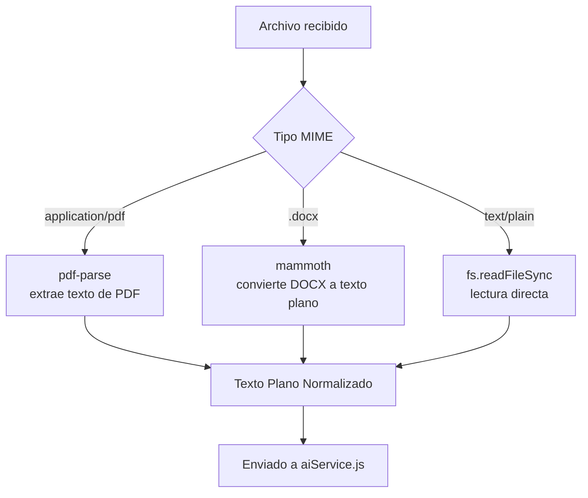
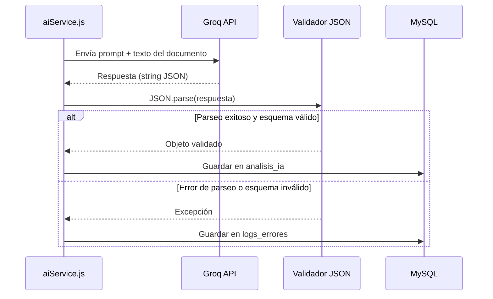
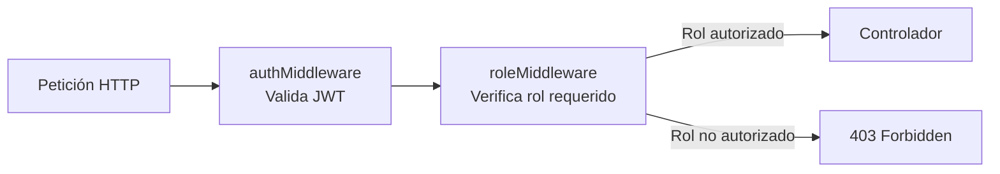

# 05 - Procesamiento con IA y Seguridad

**Proyecto:** Gestión de Facturas y Cotizaciones con IA
**Fase:** II - Diseño del Sistema

---

## 1. Flujo Detallado del Procesamiento Documental

### 1.1 Extracción de Texto

El módulo `textExtractor.js` centraliza la extracción de texto plano según el tipo de archivo, delegando en librerías especializadas:



**Consideraciones técnicas:**
- `pdf-parse` extrae el texto de todas las páginas del PDF, concatenándolo en una sola cadena.
- `mammoth` convierte el contenido de un `.docx` a texto plano (o HTML simplificado), descartando estilos irrelevantes para el análisis.
- Los archivos `.txt` se leen directamente con codificación UTF-8.
- En todos los casos se aplica una normalización básica (eliminación de saltos de línea excesivos, espacios redundantes) antes de enviar el texto a la IA.

### 1.2 Construcción del Prompt del Sistema

El `aiService.js` construye un *prompt* de sistema que **exige explícitamente una respuesta en formato JSON estricto**, minimizando la posibilidad de que el modelo devuelva texto libre no parseable:

```javascript
const SYSTEM_PROMPT = `
Eres un asistente experto en extracción de datos financieros.
Analiza el siguiente texto extraído de un documento (factura o cotización)
y responde ÚNICAMENTE con un objeto JSON válido, sin texto adicional,
sin explicaciones y sin bloques de código Markdown.

El JSON debe seguir exactamente esta estructura:
{
  "tipo_documento": "factura" | "cotizacion",
  "numero_documento": "string",
  "proveedor": "string",
  "fecha_emision": "YYYY-MM-DD",
  "items": [
    { "descripcion": "string", "cantidad": number, "valor_unitario": number }
  ],
  "total": number
}

Si algún dato no está presente en el texto, usa null en ese campo.
No inventes información que no esté explícitamente en el documento.
`;
```

La petición a la API de Groq se realiza mediante el endpoint compatible con OpenAI (`/openai/v1/chat/completions`), especificando el modelo (por ejemplo, `llama-3.3-70b-versatile`) y, cuando el modelo lo soporta, el parámetro `response_format: { type: "json_object" }` para forzar salida JSON válida.

### 1.3 Parsing y Validación del Resultado



El resultado se valida en dos niveles: **(1)** que el texto retornado sea un JSON sintácticamente válido (`JSON.parse` dentro de un bloque `try/catch`), y **(2)** que el objeto resultante cumpla el esquema esperado (tipos de datos y campos obligatorios), utilizando validación manual o una librería ligera de esquemas. Cualquier fallo en alguno de los dos niveles se registra en `logs_errores` con el mensaje de error y el *stack trace* correspondiente, sin interrumpir la disponibilidad general del sistema.

---

## 2. Diseño de Seguridad

### 2.1 Autenticación Basada en JWT

- Al iniciar sesión exitosamente, el servidor genera un token firmado con `jsonwebtoken`, incluyendo en el *payload* el `id_usuario` y el `rol`, con una **expiración configurada de 1 hora** (`expiresIn: '1h'`).
- La firma se realiza con un secreto almacenado en variable de entorno (`JWT_SECRET`), nunca *hardcodeado* en el código fuente.
- Cada petición a rutas protegidas debe incluir el token en el header `Authorization: Bearer <token>`; el `authMiddleware` lo verifica y decodifica antes de permitir el acceso al controlador.
- Ante expiración o manipulación del token, se retorna `401 Unauthorized`, obligando al cliente a reautenticarse.

### 2.2 Hashing de Contraseñas con bcryptjs

- Las contraseñas jamás se almacenan en texto plano. Al registrar un usuario, se genera un *hash* mediante `bcrypt.hash(contrasena, saltRounds)`, con `saltRounds` recomendado entre 10 y 12.
- En el login, la contraseña ingresada se compara contra el hash almacenado usando `bcrypt.compare()`, sin exponer en ningún momento el valor original.

### 2.3 Validación de Entradas

- Todas las rutas que reciben datos del cliente aplican validación de tipos, longitudes y formatos (por ejemplo, formato de correo, longitud mínima de contraseña, tipos MIME permitidos en carga de archivos).
- Se utilizan *prepared statements* a través de `mysql2/promise` en todas las consultas SQL, eliminando el riesgo de inyección SQL.
- La carga de archivos mediante `multer` restringe explícitamente las extensiones permitidas (`.pdf`, `.docx`, `.txt`) y establece un límite de tamaño máximo por archivo (por ejemplo, 10MB).

### 2.4 Manejo de Variables de Entorno (.env)

Las credenciales y configuraciones sensibles se externalizan mediante un archivo `.env` (excluido del control de versiones vía `.gitignore`):

```
PORT=3000
DB_HOST=localhost
DB_USER=root
DB_PASSWORD=
DB_NAME=gestion_facturas_ia
JWT_SECRET=clave_secreta_no_compartida
GROQ_API_KEY=gsk_xxxxxxxxxxxxxxxxxxxxx
GROQ_API_URL=https://api.groq.com/openai/v1/chat/completions
```

La librería `dotenv` carga estas variables al iniciar la aplicación (`require('dotenv').config()`), garantizando que la **API Key de Groq** y las credenciales de base de datos nunca queden expuestas en el código fuente ni en el repositorio público.

### 2.5 RBAC — Control de Acceso Basado en Roles



- El sistema define dos roles: **administrador** y **colaborador**.
- El `roleMiddleware` recibe como parámetro los roles autorizados para cada ruta (por ejemplo, `roleMiddleware(['administrador'])` para endpoints de auditoría global) y compara contra el rol decodificado del JWT.
- Si el rol del usuario no coincide con los roles permitidos, se retorna `403 Forbidden`, evitando que colaboradores accedan a funcionalidades administrativas como la gestión global de usuarios o la auditoría completa del sistema.

---

## 3. Buenas Prácticas Adicionales

- **Rate limiting** en rutas sensibles (login, chat IA) para mitigar ataques de fuerza bruta y abuso de la capa gratuita de Groq.
- **Logging estructurado** de todas las peticiones a la API de Groq (sin exponer la API Key) para facilitar auditoría técnica.
- **Sanitización de nombres de archivo** antes de almacenarlos en `/uploads`, evitando *path traversal* y colisiones de nombres (uso de UUID o timestamp como prefijo).
- **CORS configurado explícitamente**, restringiendo los orígenes permitidos al dominio del frontend en producción.
