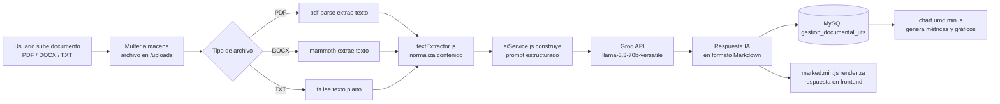

# 01. Tecnologías Utilizadas

## Proyecto: Gestión de Facturas y Cotizaciones con IA

---

## 1. Visión General del Stack Tecnológico

El sistema **"Gestión de Facturas y Cotizaciones con IA"** fue desarrollado bajo una arquitectura **cliente-servidor** tradicional, priorizando la ligereza, el control total sobre el código y la ausencia de dependencias de frameworks pesados en el frontend. Esta decisión responde a la necesidad de un despliegue simple en entornos académicos (XAMPP + Node.js) sin procesos de compilación (build steps) adicionales.

| Capa | Tecnología | Propósito |
|---|---|---|
| Backend / Servidor | Node.js + Express.js | Lógica de negocio, enrutamiento y API REST |
| Base de Datos | MySQL (vía XAMPP) | Persistencia relacional de usuarios, documentos y análisis |
| Conector BD | `mysql2/promise` | Comunicación asíncrona con MySQL usando Promesas/`async-await` |
| Inteligencia Artificial | Groq API (`llama-3.3-70b-versatile`) | Extracción, análisis y generación de texto sobre documentos |
| Frontend | HTML5, CSS Vanilla, JavaScript Vanilla | Interfaz de usuario sin frameworks (sin React/Vue/Angular) |
| Gráficos | Chart.js (`chart.umd.min.js`) | Visualización de métricas y estadísticas |
| Renderizado Markdown | Marked.js (`marked.min.js`) | Renderizado de respuestas IA en formato enriquecido |
| Procesamiento de archivos | Multer, pdf-parse, mammoth, fs | Carga y extracción de contenido de documentos |
| Autenticación | JWT (`jsonwebtoken`) + `bcryptjs` | Seguridad de sesión y almacenamiento seguro de contraseñas |
| Variables de entorno | `dotenv` (`.env.example`) | Configuración segura y portable del entorno |

---

## 2. Justificación Técnica del Backend

### 2.1 Node.js + Express.js

Se seleccionó **Node.js** como entorno de ejecución por su modelo de I/O no bloqueante, orientado a eventos, ideal para un sistema que combina operaciones de red intensivas (llamadas a la API de Groq) con lectura/escritura de archivos (subida de documentos a `/uploads/`). **Express.js** se utilizó como framework minimalista sobre Node.js para:

- Definir rutas modulares (`src/routes/`) separadas por dominio funcional (autenticación, documentos, análisis, IA, repositorios).
- Aplicar middlewares de autenticación (`authMiddleware.js`) de forma centralizada.
- Simplificar el manejo de solicitudes HTTP y respuestas JSON hacia el frontend Vanilla.

Esta arquitectura por capas (`controllers/`, `routes/`, `services/`, `middlewares/`, `config/`) sigue el patrón **MVC simplificado**, favoreciendo la separación de responsabilidades y la mantenibilidad del código.

### 2.2 MySQL + mysql2/promise

Se optó por **MySQL** ejecutado sobre **XAMPP** por ser un motor relacional robusto, ampliamente documentado y de fácil despliegue en entornos académicos y de práctica local. El uso específico del driver **`mysql2/promise`** (en lugar del driver clásico `mysql`) se justifica por:

- Soporte nativo de **Promesas**, permitiendo el uso de `async/await` en los controladores y servicios, mejorando la legibilidad frente a callbacks anidados.
- Mejor rendimiento en la ejecución de consultas preparadas (*prepared statements*), reduciendo el riesgo de inyección SQL.
- Compatibilidad total con el protocolo MySQL, incluyendo soporte para *connection pooling*, configurado en `src/config/db.js`.

---

## 3. Justificación del Módulo de Inteligencia Artificial

### 3.1 Groq API y el modelo `llama-3.3-70b-versatile`

El núcleo de inteligencia del sistema reside en la integración con **Groq Cloud**, un proveedor de inferencia de modelos de lenguaje de código abierto que expone una API **compatible con el estándar OpenAI** (`/chat/completions`). Esto permite reutilizar patrones de integración ampliamente documentados sin acoplarse a un proveedor propietario cerrado.

Se seleccionó específicamente el modelo **`llama-3.3-70b-versatile`** (Meta Llama 3.3, 70 mil millones de parámetros) por:

- Su capacidad de comprensión y generación de texto en español con calidad suficiente para tareas de análisis documental (facturas, cotizaciones).
- Su naturaleza *versatile*, orientada a tareas generales de razonamiento y extracción de información estructurada.
- La infraestructura de Groq, basada en unidades de procesamiento LPU (*Language Processing Unit*), que ofrece tiempos de inferencia significativamente menores comparados con GPUs tradicionales, aspecto crítico para una experiencia de usuario fluida al analizar documentos en tiempo real.

### 3.2 Comparativa: Groq API vs. OpenAI API

| Criterio | Groq API (`llama-3.3-70b-versatile`) | OpenAI API (`gpt-4` / `gpt-4o`) |
|---|---|---|
| Modelo base | Meta Llama 3.3 (open weights) | Modelos propietarios cerrados |
| Infraestructura | LPU (Language Processing Unit) | GPU (NVIDIA, infraestructura propia) |
| Velocidad de inferencia | Muy alta (optimizada para baja latencia) | Alta, pero generalmente menor que Groq |
| Compatibilidad de API | Compatible con esquema OpenAI (`/chat/completions`) | Estándar de facto del mercado |
| Costo | Generalmente más económico en niveles gratuitos/bajos | Mayor costo por token en modelos GPT-4 |
| Personalización del modelo | Modelo open-source, mayor transparencia | Modelo cerrado, "caja negra" |
| Uso en este proyecto | Análisis y generación de texto sobre documentos | No utilizado (evaluado como alternativa) |

La elección de Groq se fundamenta en la relación **costo-beneficio** para un proyecto académico, sumada a la baja latencia de respuesta, sin sacrificar la compatibilidad con el ecosistema estándar de integración de modelos de lenguaje tipo *chat completions*.

---

## 4. Justificación del Frontend

### 4.1 HTML5, CSS Vanilla y JavaScript Vanilla

Se decidió **no utilizar frameworks de frontend** (como React, Vue o Angular) ni frameworks de utilidades CSS (como Tailwind CSS), optando en su lugar por:

- **HTML5 semántico** (`public/index.html`) como estructura base de la interfaz.
- **CSS nativo** (`public/styles.css`), escrito manualmente, para un control total sobre el diseño visual sin dependencias externas ni pasos de compilación (*build steps*).
- **JavaScript Vanilla** (`public/app.js`), que gestiona el consumo de la API REST del backend, la manipulación del DOM y la lógica de interacción del usuario sin necesidad de un *bundler* (Webpack, Vite, etc.).

Esta decisión reduce la complejidad de despliegue, elimina la necesidad de procesos de *build*, y resulta coherente con el alcance de un proyecto académico centrado en la lógica de backend e integración de IA, más que en la sofisticación del frontend.

### 4.2 Librerías de terceros en `public/vendor/`

Ante la ausencia de un gestor de paquetes para el frontend (no hay `npm` en el navegador sin bundler), las librerías de terceros se incluyeron de forma local en `public/vendor/`:

- **`chart.umd.min.js` (Chart.js):** librería para la generación de gráficos interactivos (barras, líneas, circulares), utilizada en el módulo de análisis y métricas del sistema, permitiendo visualizar de forma comprensible los resultados generados por la IA.
- **`marked.min.js` (Marked.js):** parser que convierte texto en formato **Markdown** (tal como lo devuelve el modelo `llama-3.3-70b-versatile`) a **HTML enriquecido**, permitiendo mostrar listas, negritas, tablas y encabezados en las respuestas de la IA dentro de la interfaz web.

---

## 5. Procesamiento de Archivos

| Herramienta | Función |
|---|---|
| `multer` | Middleware de Express para la recepción y almacenamiento de archivos subidos por el usuario en el directorio `/uploads/` |
| `pdf-parse` | Extracción de texto plano desde archivos PDF (facturas y cotizaciones en formato PDF) |
| `mammoth` | Conversión y extracción de texto desde archivos DOCX (Word) |
| `fs` (módulo nativo de Node.js) | Lectura directa de archivos de texto plano (`.txt`) |

Este conjunto de herramientas permite que el módulo `textExtractor.js` (en `src/services/`) normalice el contenido de distintos formatos documentales en texto plano, listo para ser enviado como *prompt* al modelo de IA a través de `aiService.js`.

---

## 6. Seguridad y Autenticación

- **`jsonwebtoken` (JWT):** utilizado para la generación y verificación de tokens de sesión, permitiendo un esquema de autenticación *stateless* entre el frontend y el backend. El middleware `authMiddleware.js` valida el token en cada solicitud protegida.
- **`bcryptjs`:** utilizado para el hashing seguro de contraseñas antes de su almacenamiento en la base de datos, evitando el guardado de contraseñas en texto plano.
- **`dotenv` + `.env.example`:** las credenciales sensibles (cadena de conexión a MySQL, `GROQ_API_KEY`, secretos JWT) se gestionan mediante variables de entorno. El archivo `.env.example` se versiona en el repositorio como plantilla pública, mientras que el archivo real `.env` (con valores sensibles) se excluye del control de versiones.

> **Nota:** la carpeta `node_modules/` no se incluye en el repositorio, ya que contiene las dependencias de terceros instalables mediante `npm install` a partir de `package.json` y `package-lock.json`.

---

## 7. Diagrama de Flujo General del Sistema

El siguiente diagrama ilustra el flujo de datos desde la carga del documento hasta el almacenamiento del resultado del análisis en la base de datos:



---

## 8. Resumen del Stack Final

```
Backend:        Node.js + Express.js
Base de Datos:  MySQL (XAMPP) + mysql2/promise
IA:             Groq API - llama-3.3-70b-versatile
Frontend:       HTML5 + CSS Vanilla + JavaScript Vanilla
Librerías UI:   Chart.js (chart.umd.min.js), Marked.js (marked.min.js)
Archivos:       Multer, pdf-parse, mammoth, fs
Seguridad:      JWT (jsonwebtoken), bcryptjs
Config:         dotenv (.env.example)
```
