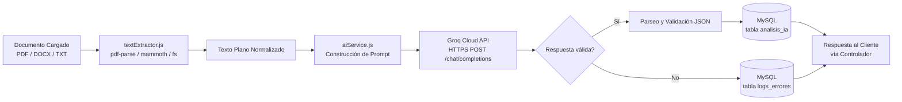

# 01 - Tecnologías Utilizadas

**Proyecto:** Gestión de Facturas y Cotizaciones con IA
**Fase:** III - Desarrollo e Implementación
**Repositorio:** `gestion-facturas-cotizaciones-ia`

---

## 1. Introducción

Este documento formaliza la justificación técnica del stack tecnológico efectivamente implementado en la Fase III, así como la arquitectura de integración entre la extracción documental, el motor de Inteligencia Artificial (Groq API) y la capa de persistencia en MySQL. El propósito es sustentar, desde una perspectiva de ingeniería de software, por qué cada tecnología fue seleccionada frente a alternativas disponibles en el mercado.

---

## 2. Justificación Técnica Formal del Stack

### 2.1 Node.js

**Rol:** entorno de ejecución del servidor backend.

**Justificación:**
- Modelo de E/S **asíncrono y no bloqueante** basado en el *Event Loop*, ideal para un sistema que realiza múltiples operaciones concurrentes de E/S: lectura de archivos subidos, consultas a MySQL y llamadas HTTPS a la API de Groq.
- Unifica el lenguaje de programación (JavaScript) entre frontend y backend, reduciendo la curva de aprendizaje del equipo de desarrollo y facilitando la reutilización de estructuras de datos (JSON) a lo largo de toda la aplicación.
- Ecosistema **npm**, el repositorio de paquetes más grande del mundo, que provee todas las librerías necesarias (`express`, `mysql2`, `multer`, `pdf-parse`, `mammoth`, `jsonwebtoken`, `bcryptjs`, `dotenv`) sin necesidad de desarrollo desde cero.

### 2.2 Express.js

**Rol:** framework web para la definición de rutas, middlewares y controladores.

**Justificación:**
- Minimalista y *unopinionated*: permite estructurar el proyecto según el patrón MVC adaptado a API REST sin imponer una arquitectura rígida.
- Sistema de middlewares en cadena (`app.use()`), que encaja naturalmente con los requisitos de seguridad del proyecto (autenticación JWT, control de roles, manejo de subida de archivos).
- Curva de aprendizaje adecuada para un curso de 6° semestre, con documentación extensa y comunidad consolidada.

### 2.3 MySQL (XAMPP) + mysql2/promise

**Rol:** motor de persistencia relacional.

**Justificación:**
- El dominio del problema (usuarios → repositorios → documentos → análisis de IA) presenta **relaciones fuertemente estructuradas y jerárquicas**, para las cuales un modelo relacional con integridad referencial (llaves foráneas) es más adecuado que una base de datos NoSQL.
- **XAMPP** simplifica el despliegue local del stack completo (Apache + MySQL) para fines académicos, sin requerir configuración de servidores en la nube.
- **`mysql2/promise`** permite el uso de `async/await` en lugar de *callbacks* anidados, mejorando la legibilidad del código, y soporta **prepared statements**, mitigando ataques de inyección SQL.

### 2.4 Tailwind CSS (vía CDN)

**Rol:** framework de utilidades CSS para el frontend.

**Justificación:**
- Enfoque *utility-first* que permite construir interfaces responsivas directamente en el HTML, sin necesidad de mantener hojas de estilo extensas ni configurar un *build process* (PostCSS/Webpack), lo cual es coherente con un frontend basado en HTML5 + JS puro servido de forma estática.
- El uso vía **CDN** evita pasos adicionales de compilación, priorizando la velocidad de desarrollo y despliegue en el contexto académico del proyecto.

### 2.5 JWT (jsonwebtoken)

**Rol:** mecanismo de autenticación *stateless*.

**Justificación:**
- Al no requerir almacenamiento de sesiones en el servidor, JWT favorece la escalabilidad horizontal de la API REST.
- Estándar de la industria (RFC 7519), ampliamente soportado y con librerías maduras en Node.js.

### 2.6 bcryptjs

**Rol:** hashing seguro de contraseñas.

**Justificación:**
- Implementación en JavaScript puro (sin dependencias nativas de compilación), lo que evita problemas de compatibilidad en distintos sistemas operativos durante el despliegue académico.
- Algoritmo de hashing adaptativo (*cost factor* configurable), resistente a ataques de fuerza bruta y de diccionario.

### 2.7 Multer

**Rol:** middleware de manejo de archivos `multipart/form-data`.

**Justificación:**
- Integración nativa con Express, permitiendo definir límites de tamaño, filtros de tipo MIME y rutas de almacenamiento de forma declarativa, sin necesidad de parsear manualmente el cuerpo de la petición.

### 2.8 pdf-parse y mammoth

**Rol:** extracción de texto plano desde documentos.

**Justificación:**
- **`pdf-parse`** es una librería ligera, sin dependencias nativas complejas, capaz de extraer el texto de archivos PDF de múltiples páginas de forma directa.
- **`mammoth`** convierte documentos `.docx` a texto plano/HTML simplificado, preservando la estructura semántica básica del contenido sin arrastrar el formato binario de Word.
- Ambas librerías permiten normalizar distintos formatos de entrada a un formato común (texto plano), simplificando la etapa posterior de análisis con IA.

### 2.9 dotenv

**Rol:** gestión de variables de entorno.

**Justificación:**
- Externaliza configuraciones sensibles (credenciales de base de datos, `JWT_SECRET`, `GROQ_API_KEY`) del código fuente, siguiendo el principio de **The Twelve-Factor App** de separar configuración y código.

---

## 3. Groq API como Motor de IA: Ventajas frente a OpenAI

| Criterio | Groq API | OpenAI API |
|---|---|---|
| **Costo** | Capa gratuita amplia, suficiente para uso académico intensivo | Requiere método de pago desde el primer uso en la mayoría de modelos actuales |
| **Velocidad de inferencia** | Utiliza hardware LPU (*Language Processing Unit*) propio, optimizado para baja latencia | Latencia variable, generalmente mayor en picos de demanda |
| **Modelos disponibles** | Modelos open-source de alto rendimiento (familia Llama) servidos en la nube de Groq | Modelos propietarios (GPT-4o, GPT-4.1, etc.) |
| **Compatibilidad de API** | Compatible con el formato de peticiones de OpenAI (`/chat/completions`), facilitando la migración futura | Formato de referencia usado como estándar de facto |
| **Salida estructurada (JSON)** | Soporta `response_format: json_object` en los modelos compatibles | Soporta *structured outputs* de forma nativa y más granular |
| **Idoneidad para el proyecto** | Óptima para un proyecto académico sin presupuesto, con necesidad de respuestas rápidas para extracción y chat semántico | Más adecuada para producción empresarial con presupuesto asignado |

**Conclusión:** para los fines de este proyecto académico —extracción estructurada de datos de facturas/cotizaciones y respuesta a consultas semánticas— Groq ofrece una relación costo-beneficio superior, dado que el equipo de desarrollo no incurre en gastos, mantiene tiempos de respuesta bajos gracias a su infraestructura especializada, y conserva compatibilidad con el estándar de la industria, lo que facilita cualquier migración futura hacia otro proveedor si el proyecto escalara a un entorno productivo real.

---

## 4. Arquitectura de Integración: Extracción → IA → Persistencia

### 4.1 Descripción del Flujo de Integración

1. **Extracción (`textExtractor.js`):** actúa como una capa de abstracción única que recibe la ruta del archivo y su tipo MIME, delegando en la librería correspondiente (`pdf-parse`, `mammoth` o lectura directa de `.txt`) y devolviendo siempre una cadena de texto plano normalizada, independientemente del formato de origen.
2. **Orquestación de IA (`aiService.js`):** recibe el texto plano, construye el *prompt* de sistema (exigiendo JSON estricto) y gestiona la comunicación HTTPS con la API de Groq, incluyendo manejo de *timeouts* y errores de red.
3. **Persistencia condicional:** el controlador que invoca a `aiService.js` decide, según el resultado, si el análisis se guarda en `analisis_ia` (caso exitoso) o si el error se registra en `logs_errores` (caso fallido), garantizando que ninguna llamada a la IA quede sin trazabilidad.
4. **Desacoplamiento:** ni `textExtractor.js` ni `aiService.js` acceden directamente a la base de datos; ambos retornan resultados al controlador, quien es responsable de la persistencia. Esto respeta el principio de **responsabilidad única** y facilita las pruebas unitarias de cada servicio de forma aislada.
