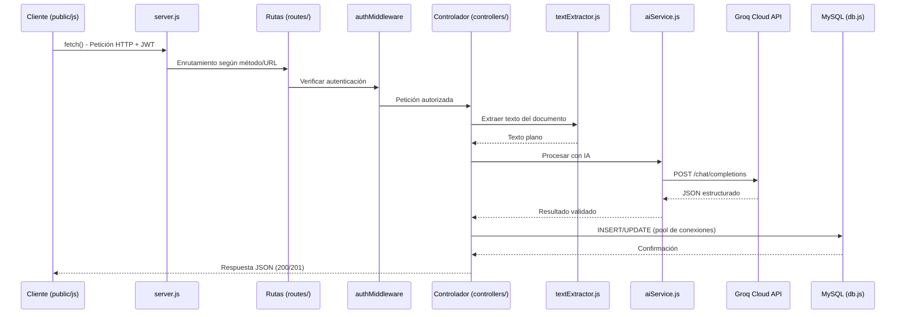

# 02 - Estructura del Proyecto

**Proyecto:** Gestión de Facturas y Cotizaciones con IA
**Fase:** III - Desarrollo e Implementación
**Ruta base:** `03-desarrollo/codigo-fuente/`

---

## 1. Árbol de Directorios

```
03-desarrollo/
└── codigo-fuente/
    ├── database/
    │   └── schema.sql
    ├── uploads/
    ├── src/
    │   ├── config/
    │   │   └── db.js
    │   ├── controllers/
    │   │   ├── authController.js
    │   │   ├── docController.js
    │   │   └── aiController.js
    │   ├── routes/
    │   │   ├── auth.routes.js
    │   │   ├── docs.routes.js
    │   │   └── ai.routes.js
    │   ├── services/
    │   │   ├── aiService.js
    │   │   └── textExtractor.js
    │   └── middlewares/
    │       └── authMiddleware.js
    ├── public/
    │   ├── index.html
    │   ├── dashboard.html
    │   ├── repositorio.html
    │   ├── chat.html
    │   └── js/
    ├── .env.example
    ├── package.json
    └── server.js
```

---

## 2. Explicación Narrativa de la Jerarquía de Carpetas

El proyecto sigue una **arquitectura por capas dentro de un mismo repositorio Node.js**, separando claramente configuración, lógica de negocio, acceso a datos e interfaz de usuario. Esta organización responde al principio de **separación de responsabilidades (SoC)**:

- **`database/`** contiene los artefactos de definición de la base de datos, independientes del código de la aplicación, permitiendo que cualquier evaluador o desarrollador reconstruya el esquema sin depender de migraciones automáticas.
- **`uploads/`** es la carpeta de almacenamiento físico de los documentos cargados por los usuarios. Se mantiene separada del código fuente de la aplicación y, en un entorno real, se excluiría del control de versiones (a excepción de un archivo `.gitkeep`).
- **`src/`** concentra toda la lógica de la aplicación backend, subdividida a su vez en `config`, `controllers`, `routes`, `services` y `middlewares`, replicando el patrón MVC adaptado a una API REST.
- **`public/`** aloja los archivos estáticos del frontend (HTML, JS de cliente), servidos directamente por Express mediante `express.static`.
- **`server.js`** es el punto de entrada de la aplicación, donde se inicializa Express, se registran los middlewares globales y se montan las rutas.
- **`.env.example`** documenta las variables de entorno requeridas sin exponer valores reales, sirviendo de plantilla para el archivo `.env` real (ignorado por Git).
- **`package.json`** declara las dependencias del proyecto y los scripts de ejecución (`start`, `dev`).

---

## 3. Rol y Responsabilidades de Cada Módulo

### 3.1 `database/schema.sql`

Contiene las sentencias DDL (`CREATE TABLE`) necesarias para construir desde cero la base de datos `gestion_documental_uts` en MySQL, incluyendo las tablas `usuarios`, `repositorios`, `documentos`, `analisis_ia` y `logs_errores`, junto con sus llaves primarias, foráneas y restricciones definidas en la Fase II. Es el artefacto que el docente ejecuta directamente en phpMyAdmin para preparar el entorno de evaluación.

### 3.2 `src/config/db.js`

Módulo responsable de crear y exportar el **pool de conexiones** a MySQL utilizando `mysql2/promise`. Centraliza la configuración de conexión (host, usuario, contraseña, base de datos) leyendo los valores desde `process.env`, de modo que ningún otro archivo del proyecto necesita conocer los detalles de conexión directamente.

```javascript
// Ejemplo conceptual de src/config/db.js
const mysql = require('mysql2/promise');

const pool = mysql.createPool({
  host: process.env.DB_HOST,
  user: process.env.DB_USER,
  password: process.env.DB_PASSWORD,
  database: process.env.DB_NAME,
  waitForConnections: true,
  connectionLimit: 10
});

module.exports = pool;
```

### 3.3 `src/controllers/`

Contiene la lógica de negocio que responde a cada petición HTTP, actuando como intermediario entre las rutas y los servicios/base de datos:

- **`authController.js`:** gestiona registro, login y consulta de perfil. Aplica `bcryptjs` para hashear/verificar contraseñas y `jsonwebtoken` para emitir tokens.
- **`docController.js`:** gestiona la creación de repositorios, la subida de documentos (en conjunto con `multer`) y la consulta de su estado, interactuando con la tabla `documentos` y el sistema de archivos `/uploads`.
- **`aiController.js`:** orquesta el procesamiento con IA, invocando `textExtractor.js` y `aiService.js`, y gestiona el endpoint de chat semántico, persistiendo resultados en `analisis_ia` o `logs_errores` según corresponda.

### 3.4 `src/routes/`

Define los *endpoints* de la API y los asocia a su respectivo controlador, además de aplicar los middlewares necesarios en cada ruta:

- **`auth.routes.js`:** rutas públicas (`/register`, `/login`) y protegida (`/perfil`).
- **`docs.routes.js`:** rutas protegidas de repositorios y carga/consulta de documentos, incorporando el middleware de `multer` en la ruta de subida.
- **`ai.routes.js`:** rutas protegidas de procesamiento con IA, edición manual de análisis y chat semántico.

### 3.5 `src/services/`

Capa de lógica de dominio reutilizable, independiente del ciclo petición-respuesta de Express:

- **`aiService.js`:** encapsula toda la comunicación con la **API de Groq**: construcción del *prompt* de sistema, envío de la petición HTTPS, manejo de tiempos de espera y parseo/validación de la respuesta JSON. Este módulo puede probarse de forma aislada (por ejemplo, con datos de entrada simulados) sin necesidad de levantar el servidor Express completo.
- **`textExtractor.js`:** unifica la extracción de texto plano a partir de PDF (`pdf-parse`), DOCX (`mammoth`) o TXT (lectura nativa de `fs`), exponiendo una única función (por ejemplo, `extraerTexto(ruta, tipoMime)`) que abstrae al resto de la aplicación de los detalles de cada formato.

### 3.6 `src/middlewares/authMiddleware.js`

Middleware transversal encargado de:
1. Extraer el token del header `Authorization`.
2. Verificar su firma y vigencia con `jsonwebtoken`.
3. Adjuntar la información decodificada del usuario (`req.usuario`) a la petición para que los controladores posteriores puedan usarla (por ejemplo, para RBAC).
4. Retornar `401 Unauthorized` si el token es inválido, ausente o expirado.

### 3.7 Vistas e Interfaces en `public/`

- **`index.html`:** vista de inicio de sesión (login) y punto de entrada de la aplicación.
- **`dashboard.html`:** panel principal con métricas e indicadores generales del usuario autenticado.
- **`repositorio.html`:** vista de gestión de un repositorio específico: listado, carga y estado de documentos.
- **`chat.html`:** interfaz de **chat semántico tipo RAG** (Retrieval-Augmented Generation simplificado), donde el usuario formula preguntas en lenguaje natural sobre los documentos ya procesados.
- **`js/`:** carpeta con los scripts de cliente en JavaScript ES6+ que consumen la API mediante `fetch`, gestionan el token JWT en almacenamiento del navegador y actualizan dinámicamente el DOM de cada vista.

---

## 4. Flujo de Interacción de Componentes (Petición → Groq → Base de Datos)



Este flujo evidencia cómo `server.js` actúa únicamente como punto de arranque y montaje de rutas, mientras que la responsabilidad de negocio recae en la cadena **rutas → middlewares → controladores → servicios → base de datos**, manteniendo cada capa desacoplada y con una única responsabilidad, lo cual facilita el mantenimiento y las pruebas del sistema durante la evaluación de la Fase III.
