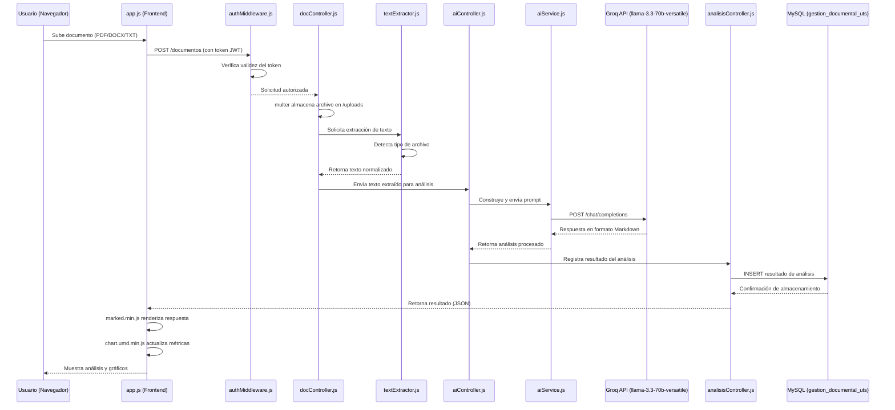

# 02. Estructura del Proyecto

## Proyecto: Gestión de Facturas y Cotizaciones con IA

---

## 1. Árbol de Directorios

A continuación se presenta la estructura real de carpetas y archivos del repositorio del proyecto:

```
gestion-facturas-cotizaciones-ia/
├── database/
│   └── schema.sql
├── public/
│   ├── vendor/
│   │   ├── chart.umd.min.js
│   │   └── marked.min.js
│   ├── app.js
│   ├── index.html
│   └── styles.css
├── src/
│   ├── config/
│   │   └── db.js
│   ├── controllers/
│   │   ├── aiController.js
│   │   ├── analisisController.js
│   │   ├── authController.js
│   │   └── docController.js
│   ├── middlewares/
│   │   └── authMiddleware.js
│   ├── routes/
│   │   ├── ai.routes.js
│   │   ├── analisis.routes.js
│   │   ├── auth.routes.js
│   │   ├── docs.routes.js
│   │   ├── documentos.routes.js
│   │   └── repos.routes.js
│   └── services/
│       ├── aiService.js
│       └── textExtractor.js
├── uploads/
├── .env.example
├── package.json
├── package-lock.json
└── server.js
```

> **Nota:** el directorio `node_modules/` no forma parte del repositorio ni del desarrollo interno del sistema; se genera automáticamente al ejecutar `npm install` a partir de `package.json` y `package-lock.json`. De igual forma, el archivo `.env` (con credenciales reales) no se versiona; en su lugar, el repositorio incluye `.env.example` como plantilla de referencia pública.

---

## 2. Descripción de Carpetas y Módulos

### 2.1 `database/`

Contiene el script SQL de definición de la base de datos.

- **`schema.sql`:** define la estructura relacional completa del sistema (tablas de usuarios, documentos, cotizaciones/facturas y resultados de análisis de IA), incluyendo claves primarias, foráneas y restricciones necesarias para la integridad referencial. Este script se importa manualmente en phpMyAdmin (XAMPP) durante la configuración inicial del proyecto, dando origen a la base de datos `gestion_documental_uts`.

### 2.2 `public/`

Carpeta que aloja todos los archivos estáticos servidos directamente al navegador del cliente (frontend).

- **`index.html`:** punto de entrada de la interfaz web; estructura semántica de las vistas (login, carga de documentos, panel de análisis, historial).
- **`styles.css`:** hoja de estilos nativa (CSS Vanilla) que define la apariencia visual completa de la aplicación, sin depender de frameworks de utilidades como Tailwind CSS.
- **`app.js`:** script principal del cliente; gestiona las llamadas `fetch` hacia la API REST del backend, la manipulación del DOM, la lógica de autenticación en el cliente (manejo del token JWT) y la orquestación de la interfaz de usuario.
- **`vendor/`:** subcarpeta que almacena librerías de terceros incluidas de forma local (sin gestor de paquetes en el navegador):
  - **`chart.umd.min.js`:** librería Chart.js utilizada para renderizar gráficos de métricas y estadísticas en el panel de análisis.
  - **`marked.min.js`:** librería Marked.js utilizada para convertir las respuestas en Markdown generadas por el modelo de IA (`llama-3.3-70b-versatile`) en HTML legible y enriquecido dentro de la interfaz.

### 2.3 `src/`

Contiene toda la lógica del lado del servidor, organizada bajo un patrón de arquitectura por capas (similar a MVC).

#### 2.3.1 `src/config/`

- **`db.js`:** módulo de configuración de la conexión a MySQL mediante `mysql2/promise`. Define el *pool* de conexiones utilizando las variables de entorno (host, usuario, contraseña, nombre de base de datos) cargadas desde `.env`.

#### 2.3.2 `src/controllers/`

Contiene la lógica de negocio que procesa las solicitudes HTTP y construye las respuestas:

- **`authController.js`:** gestiona el registro e inicio de sesión de usuarios, la generación de tokens JWT y la verificación de credenciales mediante `bcryptjs`.
- **`docController.js`:** gestiona la carga, almacenamiento y consulta de documentos (facturas y cotizaciones) subidos por el usuario.
- **`aiController.js`:** orquesta las solicitudes hacia el servicio de inteligencia artificial (`aiService.js`), recibiendo el texto extraído de los documentos y devolviendo el análisis generado por el modelo `llama-3.3-70b-versatile`.
- **`analisisController.js`:** gestiona la lógica de negocio específica de los análisis generados (histórico de análisis, consulta de resultados previos, métricas agregadas para los gráficos de Chart.js).

#### 2.3.3 `src/middlewares/`

- **`authMiddleware.js`:** middleware de Express encargado de interceptar las solicitudes a rutas protegidas, verificar la validez del token JWT enviado por el cliente y bloquear el acceso no autorizado.

#### 2.3.4 `src/routes/`

Define los *endpoints* de la API REST, delegando la lógica a los controladores correspondientes:

- **`auth.routes.js`:** rutas de autenticación (`/register`, `/login`).
- **`docs.routes.js`:** rutas generales relacionadas con la gestión documental.
- **`documentos.routes.js`:** rutas específicas para la carga y consulta de documentos (facturas/cotizaciones) individuales.
- **`ai.routes.js`:** rutas encargadas de recibir el texto extraído y enviarlo al módulo de IA para su análisis.
- **`analisis.routes.js`:** rutas para la consulta de resultados de análisis, historial y datos utilizados en los gráficos del panel de métricas.
- **`repos.routes.js`:** rutas relacionadas con la organización/repositorio de documentos del usuario (agrupación, filtrado o categorización de documentos almacenados).

#### 2.3.5 `src/services/`

Contiene la lógica reutilizable desacoplada de las rutas y controladores:

- **`aiService.js`:** servicio encargado de la comunicación directa con la API de Groq Cloud; construye el *prompt* enviado al modelo `llama-3.3-70b-versatile` bajo el esquema compatible con OpenAI (`/chat/completions`) y procesa la respuesta obtenida.
- **`textExtractor.js`:** servicio encargado de normalizar el contenido de los documentos subidos, delegando la extracción de texto a `pdf-parse` (PDF), `mammoth` (DOCX) o al módulo nativo `fs` (TXT), según el tipo de archivo recibido.

### 2.4 `uploads/`

Directorio de almacenamiento físico donde `multer` guarda los archivos originales subidos por los usuarios (facturas y cotizaciones en PDF, DOCX o TXT) antes de ser procesados por `textExtractor.js`.

### 2.5 Archivos en la raíz del proyecto

- **`.env.example`:** plantilla pública de variables de entorno necesarias para ejecutar el proyecto (credenciales de MySQL, `GROQ_API_KEY`, `GROQ_MODEL`, secreto JWT, puerto del servidor, entre otras), sin exponer valores reales sensibles.
- **`package.json`:** manifiesto del proyecto Node.js; define las dependencias (Express, mysql2, multer, pdf-parse, mammoth, jsonwebtoken, bcryptjs, dotenv, entre otras) y los *scripts* de ejecución (`npm start`).
- **`package-lock.json`:** archivo de bloqueo de versiones exactas de dependencias, garantizando instalaciones reproducibles.
- **`server.js`:** punto de entrada principal del backend; inicializa la aplicación Express, monta los middlewares globales, registra las rutas (`src/routes/`) y pone en escucha el servidor HTTP en el puerto configurado.

---

## 3. Diagrama de Secuencia: Flujo de Análisis de un Documento

El siguiente diagrama de secuencia representa la interacción real entre los componentes del sistema durante el proceso de carga y análisis de un documento (factura o cotización) mediante inteligencia artificial:



---

## 4. Resumen de Responsabilidades por Capa

| Carpeta | Responsabilidad |
|---|---|
| `database/` | Definición de la estructura de la base de datos |
| `public/` | Interfaz de usuario (frontend estático) |
| `public/vendor/` | Librerías de terceros usadas por el frontend |
| `src/config/` | Configuración de infraestructura (conexión a BD) |
| `src/controllers/` | Lógica de negocio y orquestación de solicitudes |
| `src/middlewares/` | Validaciones transversales (autenticación) |
| `src/routes/` | Definición de endpoints de la API REST |
| `src/services/` | Lógica reutilizable (IA, extracción de texto) |
| `uploads/` | Almacenamiento físico de documentos subidos |
