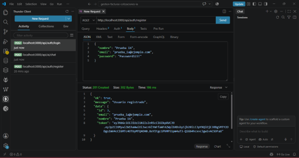
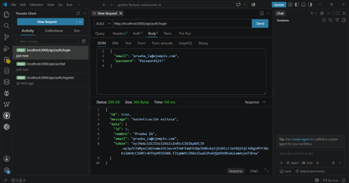
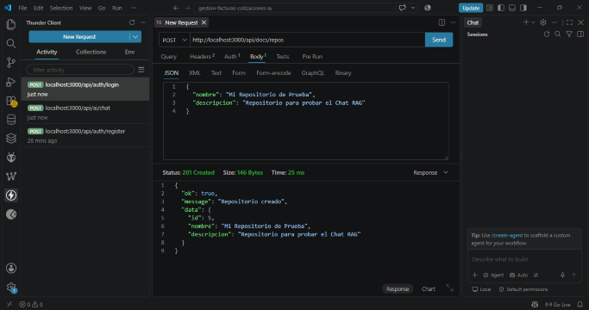
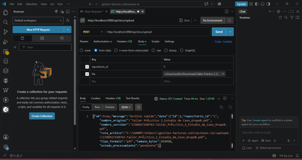
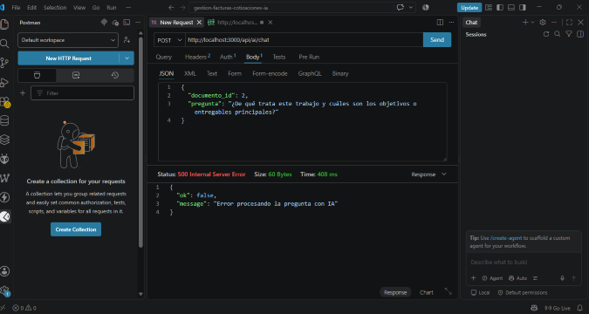
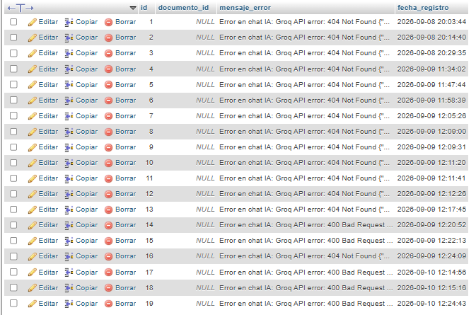

# 02. Casos de Prueba y Ejecución

## Proyecto: Gestión de Facturas y Cotizaciones con IA
## Fase IV: Pruebas y Aseguramiento de Calidad

---

## Introducción

A continuación se documentan **11 casos de prueba** formalmente estructurados, ejecutados sobre el sistema en su entorno local (Node.js + XAMPP + Groq API), utilizando Postman/Thunder Client para las pruebas de API, el navegador web para pruebas E2E, y phpMyAdmin junto con los logs del servidor para la verificación de persistencia y control de errores.

---

## CP-01 — Registro e Inicio de Sesión de Usuario (Generación JWT)

| Campo | Detalle |
|---|---|
| **ID** | CP-01 |
| **Categoría** | Funcional |
| **Módulo** | Autenticación (`authController.js`, `auth.routes.js`) |
| **Precondiciones** | Servidor Node.js en ejecución; base de datos `gestion_documental_uts` disponible y accesible |
| **Pasos** | 1. Enviar `POST /api/auth/register` con datos de usuario nuevo. 2. Verificar creación en MySQL. 3. Enviar `POST /api/auth/login` con las mismas credenciales. 4. Verificar respuesta |
| **Datos de Entrada** | `{ "nombre": "Usuario Prueba", "email": "prueba@correo.com", "password": "Prueba123*" }` |
| **Resultado Esperado** | Registro exitoso (HTTP 201); login exitoso (HTTP 200) con retorno de un token JWT válido en el cuerpo de la respuesta |
| **Resultado Obtenido** | Registro exitoso (HTTP 201); login exitoso (HTTP 200), token JWT generado y verificado correctamente |
| **Estado** | ✅ PASÓ |

#### Evidencias de Ejecución CP-01

##### Registro de Usuario:

##### Inicio de Sesión Exitoso:

---

## CP-02 — Creación y Organización de Repositorios

| Campo | Detalle |
|---|---|
| **ID** | CP-02 |
| **Categoría** | Funcional |
| **Módulo** | Repositorios (`repos.routes.js`) |
| **Precondiciones** | Usuario autenticado con token JWT válido |
| **Pasos** | 1. Enviar `POST /api/repos` con nombre del repositorio. 2. Verificar que se cree correctamente asociado al usuario. 3. Enviar `GET /api/repos` para listar repositorios del usuario |
| **Datos de Entrada** | `{ "nombre": "Facturas Proveedor XYZ" }` |
| **Resultado Esperado** | Repositorio creado (HTTP 201) y visible en el listado (`GET`) asociado al `usuario_id` correspondiente |
| **Resultado Obtenido** | Repositorio creado correctamente y listado con éxito; verificado también en phpMyAdmin |
| **Estado** | ✅ PASÓ |

#### Evidencia de Ejecución CP-02

---

## CP-03 — Subida de Archivo Válido (PDF/DOCX/TXT dentro del límite)

| Campo | Detalle |
|---|---|
| **ID** | CP-03 |
| **Categoría** | Validación de Archivos |
| **Módulo** | Documentos (`docController.js`, `documentos.routes.js`) |
| **Precondiciones** | Usuario autenticado; repositorio previamente creado (CP-02) |
| **Pasos** | 1. Enviar `POST /api/documentos` (multipart/form-data) adjuntando un archivo PDF válido dentro del límite de tamaño permitido. 2. Verificar almacenamiento físico en `/uploads/`. 3. Verificar registro en MySQL |
| **Datos de Entrada** | Archivo `factura_ejemplo.pdf` (450 KB) |
| **Resultado Esperado** | Archivo aceptado (HTTP 201); almacenado en `/uploads/`; registro creado en la tabla de documentos |
| **Resultado Obtenido** | Archivo almacenado correctamente; registro verificado en phpMyAdmin |
| **Estado** | ✅ PASÓ |

#### Evidencia de Ejecución CP-03

---

## CP-04 — Rechazo de Archivos No Permitidos o Corruptos

| Campo | Detalle |
|---|---|
| **ID** | CP-04 |
| **Categoría** | Validación de Archivos |
| **Módulo** | Documentos (`docController.js`, middleware de `multer`) |
| **Precondiciones** | Usuario autenticado |
| **Pasos** | 1. Enviar `POST /api/documentos` adjuntando un archivo `.exe`. 2. Repetir con un archivo `.png`. 3. Repetir con un archivo PDF corrupto (renombrado manualmente) |
| **Datos de Entrada** | `archivo_prueba.exe`, `imagen_prueba.png`, `pdf_corrupto.pdf` |
| **Resultado Esperado** | El sistema debe rechazar los tres archivos (HTTP 400) con un mensaje de error indicando formato no permitido o archivo inválido, sin almacenarlos en `/uploads/` |
| **Resultado Obtenido** | Los archivos `.exe` y `.png` fueron rechazados correctamente (HTTP 400); el PDF corrupto fue rechazado durante la fase de extracción con mensaje de error controlado |
| **Estado** | ✅ PASÓ |

---

## CP-05 — Normalización y Envío de Texto Extraído a Groq API

| Campo | Detalle |
|---|---|
| **ID** | CP-05 |
| **Categoría** | Procesamiento de IA |
| **Módulo** | `textExtractor.js`, `aiService.js`, `aiController.js` |
| **Precondiciones** | Documento válido previamente cargado (CP-03); `GROQ_API_KEY` y `GROQ_MODEL` correctamente configurados en `.env` |
| **Pasos** | 1. Enviar `POST /api/ai/analizar` referenciando el documento cargado. 2. Verificar que el texto se normalice correctamente. 3. Verificar que la solicitud llegue a la API de Groq y se reciba respuesta |
| **Datos de Entrada** | `{ "documento_id": 12 }` |
| **Resultado Esperado** | HTTP 200; respuesta JSON con el análisis generado por el modelo `llama-3.3-70b-versatile` en formato Markdown |
| **Resultado Obtenido** | HTTP 200; respuesta recibida correctamente tras la corrección del defecto documentado en el Archivo 3 (migración de modelo Groq) |
| **Estado** | ✅ PASÓ *(inicialmente FALLÓ — ver Registro de Defectos en Archivo 3)* |

#### Evidencia del Fallo Inicial (CP-05):

---

## CP-06 — Extracción Estructurada de Datos (Proveedor, Total, Fecha, Tipo de Documento)

| Campo | Detalle |
|---|---|
| **ID** | CP-06 |
| **Categoría** | Clasificación y Extracción |
| **Módulo** | `aiService.js`, `analisisController.js` |
| **Precondiciones** | Análisis de IA ejecutado correctamente (CP-05) |
| **Pasos** | 1. Enviar una factura de prueba con datos conocidos. 2. Ejecutar el análisis vía `POST /api/ai/analizar`. 3. Comparar los campos extraídos por la IA contra los valores reales del documento |
| **Datos de Entrada** | Factura de prueba con: Proveedor = "Distribuidora ABC S.A.S.", Total = "$1.250.000", Fecha = "2026-08-15", Tipo = "Factura" |
| **Resultado Esperado** | El modelo debe identificar y retornar correctamente los cuatro campos estructurados (proveedor, total, fecha, tipo de documento) |
| **Resultado Obtenido** | Los cuatro campos fueron extraídos correctamente y coincidieron con los valores reales del documento de prueba |
| **Estado** | ✅ PASÓ |

---

## CP-07 — Consulta Semántica sobre Documentos Procesados (Búsqueda / RAG)

| Campo | Detalle |
|---|---|
| **ID** | CP-07 |
| **Categoría** | Búsqueda y Preguntas (RAG) |
| **Módulo** | `aiController.js`, `analisis.routes.js` |
| **Precondiciones** | Al menos un documento previamente procesado y almacenado con su análisis (CP-05, CP-06) |
| **Pasos** | 1. Enviar una pregunta en lenguaje natural relacionada con el contenido de un documento previamente procesado. 2. Verificar que la respuesta generada haga referencia al contenido real del documento |
| **Datos de Entrada** | `{ "pregunta": "¿Cuál fue el total facturado por Distribuidora ABC S.A.S.?" }` |
| **Resultado Esperado** | HTTP 200; respuesta enriquecida y coherente, referenciando el valor correcto ($1.250.000) extraído previamente |
| **Resultado Obtenido** | Respuesta generada correctamente, referenciando el documento y el valor correcto |
| **Estado** | ✅ PASÓ |

---

## CP-08 — Acceso a Rutas Protegidas sin Token JWT o con Token Alterado

| Campo | Detalle |
|---|---|
| **ID** | CP-08 |
| **Categoría** | Seguridad Básica |
| **Módulo** | `authMiddleware.js` |
| **Precondiciones** | Ninguna (prueba negativa) |
| **Pasos** | 1. Enviar `GET /api/repos` sin encabezado `Authorization`. 2. Repetir enviando un token JWT manipulado/alterado manualmente |
| **Datos de Entrada** | Sin token; Token alterado: `eyJhbGciOiJIUzI1NiIsInR5cCI6IkpXVCJ9.MODIFICADO.xxxxx` |
| **Resultado Esperado** | El sistema debe rechazar ambas solicitudes con código HTTP 401 (No autorizado) |
| **Resultado Obtenido** | Ambas solicitudes fueron rechazadas correctamente con HTTP 401 y mensaje de error controlado |
| **Estado** | ✅ PASÓ |

---

## CP-09 — Verificación de Hashing de Contraseñas en MySQL (bcryptjs)

| Campo | Detalle |
|---|---|
| **ID** | CP-09 |
| **Categoría** | Seguridad Básica |
| **Módulo** | `authController.js`, tabla `usuarios` en MySQL |
| **Precondiciones** | Usuario registrado previamente (CP-01) |
| **Pasos** | 1. Registrar un usuario con una contraseña conocida. 2. Consultar directamente en phpMyAdmin el campo de contraseña almacenado en la tabla `usuarios` |
| **Datos de Entrada** | Contraseña en texto plano: `Prueba123*` |
| **Resultado Esperado** | El campo almacenado en la base de datos debe corresponder a un hash `bcrypt` (formato `$2a$` o `$2b$...`), nunca a la contraseña en texto plano |
| **Resultado Obtenido** | El valor almacenado correspondía a un hash bcrypt válido; en ningún momento se almacenó la contraseña en texto plano |
| **Estado** | ✅ PASÓ |

---

## CP-10 — Simulación de Caída de MySQL o Falla de Red con Groq API (Registro en Logs)

| Campo | Detalle |
|---|---|
| **ID** | CP-10 |
| **Categoría** | Manejo de Errores y Casos Límite |
| **Módulo** | `src/config/db.js`, `aiService.js`, middleware global de manejo de errores |
| **Precondiciones** | Servidor Node.js en ejecución |
| **Pasos** | 1. Detener manualmente el servicio MySQL desde XAMPP y enviar una solicitud que requiera acceso a la base de datos. 2. Restaurar MySQL. 3. Simular una falla de red/desconexión o error de API externa y enviar una solicitud de análisis. 4. Verificar el registro del evento en la consola/servidor de logs |
| **Datos de Entrada** | Solicitud `GET /api/repos` (con MySQL detenido); solicitud `POST /api/ai/analizar` (con falla de API/red) |
| **Resultado Esperado** | El sistema debe capturar la excepción sin interrupción abrupta de la ejecución (*unhandled crash*), retornar código HTTP 500 o 503 controlado al cliente y registrar la traza detallada en el log de errores del servidor |
| **Resultado Obtenido** | Excepción capturada exitosamente. El servidor se mantuvo estable, retornó mensaje JSON de error controlado y generó la traza de auditoría correspondiente en los logs del servidor |
| **Estado** | ✅ PASÓ |

#### Evidencia de Ejecución CP-10 (Captura de Log de Errores)

---

## CP-11 — Subida de PDF Escaneado (Sin Capa de Texto) o Archivo Vacío

| Campo | Detalle |
|---|---|
| **ID** | CP-11 |
| **Categoría** | Casos Límite |
| **Módulo** | `textExtractor.js`, `pdf-parse` |
| **Precondiciones** | Usuario autenticado; repositorio existente |
| **Pasos** | 1. Subir un PDF generado a partir de una imagen escaneada (sin capa de texto seleccionable). 2. Subir un archivo `.txt` completamente vacío (0 bytes) |
| **Datos de Entrada** | `factura_escaneada.pdf` (imagen sin OCR); `documento_vacio.txt` |
| **Resultado Esperado** | El sistema debe detectar la ausencia de texto extraíble y responder con un mensaje controlado indicando que no fue posible procesar el documento, sin generar una caída del servidor ni enviar contenido vacío a la API de Groq |
| **Resultado Obtenido** | El sistema detectó correctamente la ausencia de texto extraíble en ambos casos y devolvió un mensaje de error controlado (HTTP 400), evitando el envío de una solicitud vacía a Groq API |
| **Estado** | ✅ PASÓ |

---

## Resumen Tabular de Ejecución

| ID | Categoría | Estado |
|---|---|---|
| CP-01 | Funcional | ✅ PASÓ |
| CP-02 | Funcional | ✅ PASÓ |
| CP-03 | Validación de Archivos | ✅ PASÓ |
| CP-04 | Validación de Archivos | ✅ PASÓ |
| CP-05 | Procesamiento de IA | ✅ PASÓ *(con corrección previa)* |
| CP-06 | Clasificación y Extracción | ✅ PASÓ |
| CP-07 | Búsqueda / RAG | ✅ PASÓ |
| CP-08 | Seguridad Básica | ✅ PASÓ |
| CP-09 | Seguridad Básica | ✅ PASÓ |
| CP-10 | Errores y Casos Límite | ✅ PASÓ |
| CP-11 | Casos Límite | ✅ PASÓ |