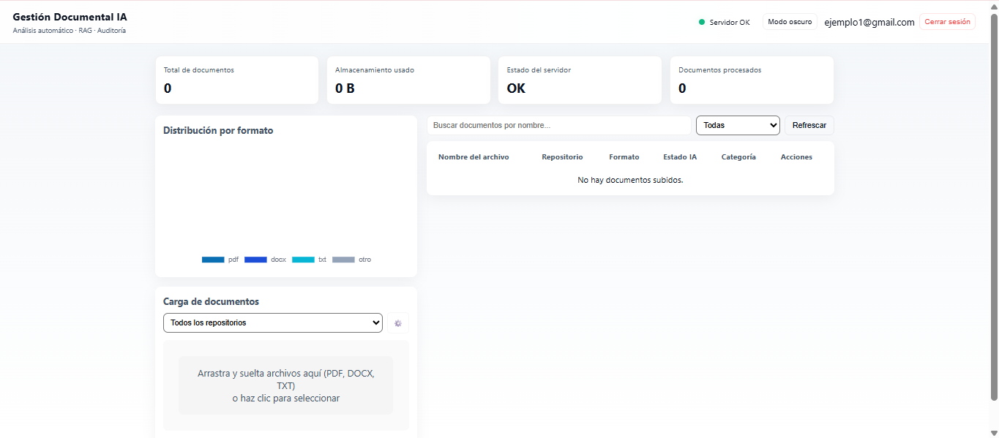
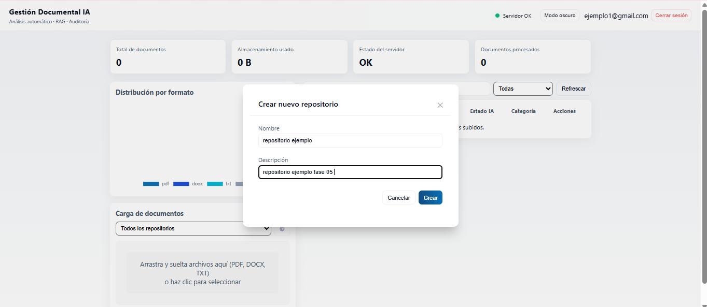
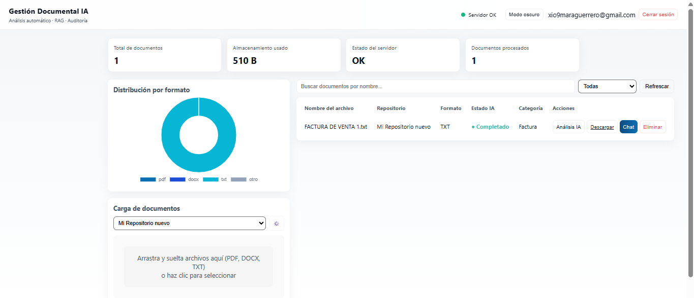

# Fase V — Implementación y Despliegue
## Sistema de Gestión Documental de Facturas y Cotizaciones con IA


---

## 1. Descripción del Ambiente de Implementación

El sistema se implementa bajo un ambiente de **desarrollo local con simulación de servidor**, que reproduce las condiciones de un entorno de producción reducido, apto para fines académicos y de validación funcional.

| Componente | Rol en el ambiente | Herramienta utilizada |
|---|---|---|
| Servidor de aplicaciones | Ejecuta la API REST en Node.js/Express | Node.js (runtime local) |
| Servidor de base de datos | Gestiona el motor MySQL | XAMPP (módulo MySQL/MariaDB) |
| Administrador de BD | Interfaz gráfica de administración | phpMyAdmin (incluido en XAMPP) |
| Cliente | Consumo de la interfaz web | Navegador (Chrome/Edge) |
| Servicio de IA | Procesamiento de lenguaje natural | Groq Cloud API (externo, bajo demanda) |

Este esquema permite validar el ciclo completo de la aplicación (autenticación, carga de documentos, análisis con IA y búsqueda semántica) sin necesidad de un servidor de producción dedicado, cumpliendo así con el alcance definido para el proyecto de VI semestre.

---

## 2. Requisitos de Hardware y Software

### 2.1 Requisitos del Servidor (equipo donde corre el backend y XAMPP)

| Recurso | Mínimo | Recomendado |
|---|---|---|
| Procesador | Dual Core 2.0 GHz | Quad Core 2.5 GHz+ |
| Memoria RAM | 4 GB | 8 GB o superior |
| Almacenamiento | 5 GB libres | 10 GB libres (SSD recomendado) |
| Sistema Operativo | Windows 10 / Linux Ubuntu 20.04+ | Windows 11 / Ubuntu 22.04+ |
| Conexión a Internet | Requerida (para consumo de Groq API) | Banda ancha estable |

### 2.2 Requisitos de Software (Servidor)

| Software | Versión mínima | Propósito |
|---|---|---|
| Node.js | 18.x LTS | Motor de ejecución del backend |
| npm | 9.x | Gestor de dependencias |
| XAMPP | 8.0+ (PHP 8, MySQL/MariaDB) | Motor de base de datos y phpMyAdmin |
| Git | 2.40+ | Control de versiones y clonación del repositorio |
| Editor de código | VS Code (recomendado) | Desarrollo y mantenimiento |

### 2.3 Requisitos del Cliente (usuario final)

| Recurso | Requisito |
|---|---|
| Navegador web | Google Chrome, Microsoft Edge o Firefox (versión reciente) |
| Resolución mínima | 1280x720 |
| Conexión a Internet | Requerida para el correcto funcionamiento de la app |
| JavaScript | Habilitado en el navegador |

---

## 3. Configuración de Base de Datos y Almacenamiento

### 3.1 Motor y nombre de la base de datos

- **Motor:** MySQL (gestionado mediante XAMPP)
- **Nombre de la base de datos:** `gestion_documental_uts`
- **Administración:** phpMyAdmin (`http://localhost/phpmyadmin`)

### 3.2 Script de creación de la base de datos (`schema.sql`)

```sql
-- Script SQL para XAMPP / phpMyAdmin hecho por xiomara mendoza
-- Aplicaciones Empresariales - Universidad Tecnológica de Santander
-- Crea la base de datos y las tablas necesarias para el proyecto
-- Base de datos: gestion_documental_uts

DROP DATABASE IF EXISTS gestion_documental_uts;
CREATE DATABASE gestion_documental_uts CHARACTER SET utf8mb4 COLLATE utf8mb4_general_ci;
USE gestion_documental_uts;

-- Tabla usuarios
CREATE TABLE usuarios (
  id INT UNSIGNED AUTO_INCREMENT PRIMARY KEY,
  nombre VARCHAR(150) NOT NULL,
  email VARCHAR(255) NOT NULL UNIQUE,
  password_hash VARCHAR(255) NOT NULL,
  rol ENUM('admin','usuario') NOT NULL DEFAULT 'usuario',
  fecha_creacion TIMESTAMP NOT NULL DEFAULT CURRENT_TIMESTAMP
) ENGINE=InnoDB DEFAULT CHARSET=utf8mb4;

-- Tabla repositorios
CREATE TABLE repositorios (
  id INT UNSIGNED AUTO_INCREMENT PRIMARY KEY,
  usuario_id INT UNSIGNED NOT NULL,
  nombre VARCHAR(200) NOT NULL,
  descripcion TEXT,
  fecha_creacion TIMESTAMP NOT NULL DEFAULT CURRENT_TIMESTAMP,
  FOREIGN KEY (usuario_id) REFERENCES usuarios(id) ON DELETE CASCADE
) ENGINE=InnoDB DEFAULT CHARSET=utf8mb4;

-- Tabla documentos
CREATE TABLE documentos (
  id INT UNSIGNED AUTO_INCREMENT PRIMARY KEY,
  repositorio_id INT UNSIGNED NOT NULL,
  nombre_original VARCHAR(255) NOT NULL,
  nombre_servidor VARCHAR(255) NOT NULL,
  ruta_archivo VARCHAR(1024) NOT NULL,
  tipo_formato VARCHAR(50) NOT NULL, -- pdf, docx, txt
  tamano_bytes BIGINT UNSIGNED DEFAULT 0,
  estado_procesamiento ENUM('pendiente','procesando','completado','error') DEFAULT 'pendiente',
  fecha_subida TIMESTAMP NOT NULL DEFAULT CURRENT_TIMESTAMP,
  FOREIGN KEY (repositorio_id) REFERENCES repositorios(id) ON DELETE CASCADE
) ENGINE=InnoDB DEFAULT CHARSET=utf8mb4;

-- Tabla analisis_ia
CREATE TABLE analisis_ia (
  id INT UNSIGNED AUTO_INCREMENT PRIMARY KEY,
  documento_id INT UNSIGNED NOT NULL,
  categoria ENUM('Factura','Cotización','Cuenta de Cobro','Otro') DEFAULT 'Otro',
  resumen TEXT,
  datos_extraidos_json JSON,
  fecha_analisis TIMESTAMP NOT NULL DEFAULT CURRENT_TIMESTAMP,
  FOREIGN KEY (documento_id) REFERENCES documentos(id) ON DELETE CASCADE
) ENGINE=InnoDB DEFAULT CHARSET=utf8mb4;

-- Tabla logs_errores
CREATE TABLE logs_errores (
  id INT UNSIGNED AUTO_INCREMENT PRIMARY KEY,
  documento_id INT UNSIGNED NULL,
  mensaje_error TEXT NOT NULL,
  fecha_registro TIMESTAMP NOT NULL DEFAULT CURRENT_TIMESTAMP,
  FOREIGN KEY (documento_id) REFERENCES documentos(id) ON DELETE SET NULL
) ENGINE=InnoDB DEFAULT CHARSET=utf8mb4;

-- Inserciones iniciales
INSERT INTO usuarios (nombre, email, password_hash, rol)
VALUES ('Admin UTS', 'admin@uts.edu', '$2a$10$CwTycUXWue0Thq9StjUM0uJ8sWq3qQxA1J/6pG0YyF7Z8V7Zr0p6', 'admin');

INSERT INTO repositorios (usuario_id, nombre, descripcion)
VALUES
  (1, 'Repositorio Facturas 2026', 'Repositorio de facturas de ejemplo para el demo'),
  (1, 'Repositorio Cotizaciones - Ventas', 'Cotizaciones comerciales y propuestas'),
  (1, 'Repositorio Mis Documentos', 'Documentos misceláneos para pruebas');

CREATE INDEX idx_documentos_repositorio ON documentos(repositorio_id);
CREATE INDEX idx_analisis_documento ON analisis_ia(documento_id);
CREATE INDEX idx_logs_documento ON logs_errores(documento_id);
```

### 3.3 Descripción del modelo de datos

| Tabla | Propósito | Relación |
|---|---|---|
| `usuarios` | Almacena las cuentas del sistema, con rol `admin` o `usuario` y contraseña protegida en `password_hash` | Padre de `repositorios` |
| `repositorios` | Agrupa documentos por categoría o proyecto, asociados a un `usuario_id` | Padre de `documentos` |
| `documentos` | Registra cada archivo cargado, su ubicación física (`ruta_archivo`), formato (`tipo_formato`) y estado de procesamiento (`estado_procesamiento`) | Padre de `analisis_ia` y `logs_errores` |
| `analisis_ia` | Guarda el resultado del análisis con IA: `categoria`, `resumen` y `datos_extraidos_json` (estructura JSON con los campos extraídos) | Hijo de `documentos` |
| `logs_errores` | Registra fallas de procesamiento asociadas (o no) a un documento específico, útil para diagnóstico y soporte | Hijo opcional de `documentos` |

> **Nota técnica:** El campo `documento_id` en `logs_errores` permite valores `NULL` (`ON DELETE SET NULL`), ya que algunos errores pueden ocurrir antes de que exista un registro de documento válido (por ejemplo, fallos en la subida del archivo).

### 3.4 Almacenamiento físico de archivos

Los documentos cargados por los usuarios se almacenan físicamente en el servidor mediante el middleware `multer`, en la carpeta `/uploads/`. El nombre generado para cada archivo en disco corresponde al campo `nombre_servidor`, mientras que `nombre_original` conserva el nombre con el que el usuario lo cargó, y `ruta_archivo` registra la ruta relativa completa dentro del servidor.

```
/uploads/
   ├── facturas/
   ├── cotizaciones/
   └── temp/
```

---

## 4. Configuración de Servicios de Inteligencia Artificial

### 4.1 Registro en Groq Cloud

1. Ingresar a [https://console.groq.com](https://console.groq.com) y crear una cuenta de desarrollador.
2. Acceder a la sección **API Keys** del panel de control.
3. Generar una nueva clave (`Create API Key`) y copiarla de inmediato, ya que Groq no la muestra nuevamente.
4. Almacenar la clave únicamente en el archivo `.env` del proyecto (nunca en el repositorio Git).

### 4.2 Modelo utilizado

| Parámetro | Valor |
|---|---|
| Proveedor | Groq Cloud |
| Modelo | `llama-3.3-70b-versatile` |
| Tipo de tarea | Extracción de datos estructurados, resumen, RAG |
| Formato de respuesta | JSON estructurado, persistido en `analisis_ia.datos_extraidos_json` |

### 4.3 Límites de tasa (Rate Limits)

> **Nota:** Los límites de tasa dependen del nivel de cuenta (free tier / pagado) y pueden cambiar según la política vigente de Groq Cloud. Se recomienda verificar los límites actuales en el panel oficial de Groq antes de cada despliegue, ya que impactan directamente la cantidad de solicitudes de análisis por minuto que la aplicación puede procesar.

Buenas prácticas implementadas en el proyecto ante los límites de tasa:
- Manejo de errores HTTP `429 Too Many Requests` con reintento controlado.
- Cola de procesamiento secuencial para evitar ráfagas de solicitudes simultáneas.
- Registro del incidente en la tabla `logs_errores` cuando el servicio de IA no responde correctamente.
- Actualización del campo `estado_procesamiento` del documento a `error` cuando el análisis no puede completarse.

---

## 5. Variables de Entorno y Configuración Segura

### 5.1 Archivo `.env` (uso local, **no se sube al repositorio**)

```env
# Configuración del servidor
PORT=3000

# Configuración de la base de datos MySQL (XAMPP)
DB_HOST=localhost
DB_USER=root
DB_PASS=
DB_NAME=gestion_documental_uts

# Seguridad y autenticación
JWT_SECRET=clave_secreta_jwt_uts_2025

# Servicio de Inteligencia Artificial (Groq Cloud)
GROQ_API_KEY=gsk_xxxxxxxxxxxxxxxxxxxxxxxxxxxxxxxx
GROQ_MODEL=llama-3.3-70b-versatile
```

### 5.2 Archivo `.env.example` (plantilla de referencia, sí se sube al repositorio)

```env
# Configuración del servidor
PORT=3000

# Configuración de la base de datos MySQL
DB_HOST=localhost
DB_USER=root
DB_PASS=tu_password_aqui
DB_NAME=gestion_documental_uts

# Seguridad y autenticación
JWT_SECRET=define_una_clave_secreta_segura

# Servicio de Inteligencia Artificial (Groq Cloud)
GROQ_API_KEY=tu_api_key_de_groq
GROQ_MODEL=llama-3.3-70b-versatile
```

### 5.3 Descripción de variables

| Variable | Descripción | Sensible |
|---|---|---|
| `PORT` | Puerto en el que escucha el servidor Express | No |
| `DB_HOST` | Host del servidor MySQL (local: `localhost`) | No |
| `DB_USER` | Usuario de conexión a MySQL | Sí |
| `DB_PASS` | Contraseña del usuario de MySQL | Sí |
| `DB_NAME` | Nombre de la base de datos del proyecto | No |
| `JWT_SECRET` | Clave secreta para firmar y verificar tokens JWT | Sí |
| `GROQ_API_KEY` | Clave de autenticación para consumir la API de Groq Cloud | Sí |
| `GROQ_MODEL` | Identificador del modelo de IA activo | No |

> **Importante:** El archivo `.env` debe incluirse en `.gitignore` para evitar la exposición de credenciales. Solo `.env.example` debe versionarse en Git como referencia para nuevos entornos.

---

## 6. Proceso de Instalación Paso a Paso

```bash
# 1. Clonar el repositorio del proyecto
git clone https://github.com/usuario/gestion-facturas-cotizaciones-ia.git
cd gestion-facturas-cotizaciones-ia

# 2. Instalar las dependencias del backend
npm install

# 3. Crear el archivo .env a partir de la plantilla
cp .env.example .env
# Editar .env con los valores reales (DB_PASS, JWT_SECRET, GROQ_API_KEY)
```

### 6.1 Configuración de la base de datos en phpMyAdmin

1. Iniciar los módulos **Apache** y **MySQL** desde el panel de control de XAMPP.
2. Acceder a `http://localhost/phpmyadmin`.
3. Ir a la pestaña **SQL** y ejecutar el contenido completo del archivo `schema.sql` (o importarlo desde la pestaña **Importar**).
4. El script crea automáticamente la base de datos `gestion_documental_uts`, sus cinco tablas (`usuarios`, `repositorios`, `documentos`, `analisis_ia`, `logs_errores`), los índices asociados y los datos iniciales (usuario administrador y tres repositorios de ejemplo).
5. Verificar en el panel izquierdo de phpMyAdmin que las cinco tablas se hayan creado correctamente y que la tabla `usuarios` contenga el registro `Admin UTS`.

---

## 7. Proceso de Despliegue Local y Ejecución

```bash
# Ejecución estándar
npm start

# Ejecución alternativa directa
node src/app.js

# Ejecución en modo desarrollo (recarga automática)
npx nodemon src/app.js
```

Al ejecutar cualquiera de los comandos anteriores, la consola debe mostrar un mensaje de confirmación similar a:

```
Servidor corriendo en http://localhost:3000
Conexión a la base de datos establecida correctamente
```

---

## 8. Acceso a la Aplicación

| Elemento | Detalle |
|---|---|
| URL de acceso | `http://localhost:3000` |
| Método de autenticación | Login con `email` y contraseña (JWT) |
| Usuario inicial (rol `admin`) | `admin@uts.edu` (ver nota sobre la contraseña) |

**Flujo de autenticación:**
1. El usuario ingresa `email` y contraseña en la vista de login (`index.html`).
2. El backend busca el registro correspondiente en la tabla `usuarios` y compara la contraseña ingresada contra el valor almacenado en `password_hash` usando `bcryptjs`.
3. Si son válidas, el servidor genera un token JWT firmado con `JWT_SECRET` y lo retorna al cliente.
4. El token se almacena en el cliente y se envía en el encabezado `Authorization: Bearer <token>` en cada solicitud a rutas protegidas.
5. El middleware de autenticación valida el token y, cuando aplica, verifica el campo `rol` (`admin` / `usuario`) antes de permitir el acceso a funcionalidades restringidas.

> **Nota:** El registro inicial de `usuarios` insertado por `schema.sql` corresponde a un hash de contraseña de ejemplo, no a una contraseña real conocida. Antes de la sustentación, debe generarse un nuevo hash con `bcryptjs` para una contraseña definitiva del usuario `admin@uts.edu` (actualizándolo directamente en la base de datos), o registrar un nuevo usuario administrador desde el propio sistema.

---

## 9. Evidencias del Sistema Funcionando

**Creación de usuario en el sistema:**


**Inicio de sesión exitoso:**



**Creación de repositorio exitosa:**



**Carga de archivo Exitosa:**




---

*Documento generado como parte del entregable de la Fase V — Implementación, Despliegue, Manuales y Mantenimiento.*